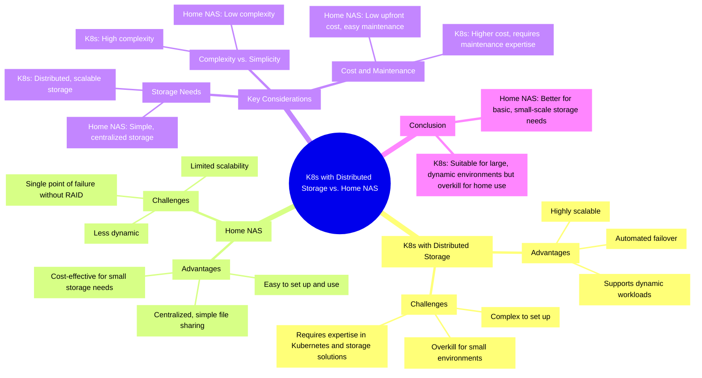

# Semesterarbeit 04 - Can Kubernetes with Distributed Storage Replace a Home NAS?

Im Zeitalter der digitalen Transformation suchen immer mehr private Haushalte nach zuverlässigen und effizienten Lösungen zur Speicherung und Verwaltung ihrer Daten. Ein zentraler Aspekt dabei ist die Datenhoheit und der Speicherort der eigenen Daten, welche beim Enduser liegen und nicht bei einem Cloud-Provider wie OneDrive von Microsoft oder Google Drive von Google. Traditionelle NAS-Systeme (Network Attached Storage) sind zwar weit verbreitet, stossen jedoch zunehmend an ihre Grenzen in Bezug auf Skalierbarkeit, Flexibilität und Verwaltung. Kubernetes (K8s) hat sich als leistungsstarke Plattform zur Orchestrierung von containerisierten Anwendungen etabliert, aber kann K8s mit verteiltem Speicher eine tragfähige Alternative zu einem herkömmlichen NAS für den Heimgebrauch darstellen? Diese Semesterarbeit zielt darauf ab, die Machbarkeit und Vorteile eines solchen Setups zu untersuchen. Durch die Implementierung und den Vergleich von Kubernetes mit verteiltem Speicher und einem traditionellen NAS sollen Aspekte wie Leistung, Benutzerfreundlichkeit, Kosten und Skalierbarkeit bewertet werden. Ziel ist es, zu bestimmen, ob K8s mit verteiltem Speicher eine praktikable und vorteilhafte Lösung für die private Datenspeicherung und -verwaltung bieten kann.

## Inhaltsverzeichnis

- [1. Einleitung](docs/index.md)
- [2. Projektorganisation](docs/02_projektorganisation/index.md)
  - [2.1 Projektmethode](docs/02_projektorganisation/01_projektmethode.md)
  - [2.2 Projektorganisation](docs/02_projektorganisation/02_projektorganisation.md)
  - [2.3 SWOT Analyse](docs/02_projektorganisation/03_swot.md)
  - [2.4 Tools & Software](docs/02_projektorganisation/04_tools.md)
  - [2.5 GIT Branching Konzept](docs/02_projektorganisation/05_git_branching_konzept.md)
  - [2.6 Risikomanagement](docs/02_projektorganisation/06_risk_management.md)
  - [2.7 TimeTracking](docs/02_projektorganisation/07_timetracking.md)
  - [2.8 Sprint 01](docs/02_projektorganisation/08_sprint01/index.md)
    - [2.8.1 Sprint Planning](docs/02_projektorganisation/08_sprint01/01_planning.md)
    - [2.8.2 Backlog Refinement](docs/02_projektorganisation/08_sprint01/02_refinement.md)
    - [2.8.3 Sprint Review](docs/02_projektorganisation/08_sprint01/03_review.md)
    - [2.8.4 Sprint Retro](docs/02_projektorganisation/08_sprint01/04_retro.md)
    - [2.8.5 Riskboard Meeting](docs/02_projektorganisation/08_sprint01/05_riskboard.md)
  - [2.9 Sprint 02](docs/02_projektorganisation/09_sprint02/index.md)
    - [2.9.1 Sprint Planning](docs/02_projektorganisation/09_sprint02/01_planning.md)
    - [2.9.2 Backlog Refinement](docs/02_projektorganisation/09_sprint02/02_refinement.md)
    - [2.9.3 Sprint Review](docs/02_projektorganisation/09_sprint02/03_review.md)
    - [2.9.4 Sprint Retro](docs/02_projektorganisation/09_sprint02/04_retro.md)
    - [2.9.5 Riskboard Meeting](docs/02_projektorganisation/09_sprint02/05_riskboard.md)
  - [2.10 Sprint 03](docs/02_projektorganisation/10_sprint03/index.md)
    - [2.10.1 Sprint Planning](docs/02_projektorganisation/10_sprint03/01_planning.md)
    - [2.10.2 Backlog Refinement](docs/02_projektorganisation/10_sprint03/02_refinement.md)
    - [2.10.3 Sprint Review](docs/02_projektorganisation/10_sprint03/03_review.md)
    - [2.10.4 Sprint Retro](docs/02_projektorganisation/10_sprint03/04_retro.md)
    - [2.10.5 Riskboard Meeting](docs/02_projektorganisation/10_sprint03/05_riskboard.md)
- [3. K8s vs. NAS](docs/03_k8s_vs_nas.md)
- [4. Service Design](docs/04_service_design/index.md)
  - [4.1 Anforderungen](docs/04_service_design/01_idea.md)
  - [4.2 Kubernetes Distribution](docs/04_service_design/02_k8s.md)
  - [4.3 Distributed Storage Solution](docs/04_service_design/03_dirstibuted_storage.md)
  - [4.4 GitOps](docs/04_service_design/04_gitops.md)
  - [4.5 Architektur und Technologie](docs/04_service_design/05_architecture.md)
  - [4.6 Servicekosten](docs/04_service_design/06_cost.md)
- [5. Deployment](docs/05_deployment/index.md)
  - [5.1 Kubernetes](docs/05_deployment/01_k8s.md)
  - [5.2 ArgoCD](docs/05_deployment/02_argocd.md)
  - [5.3 Longhorn](docs/05_deployment/03_longhorn.md)
  - [5.4 Cilium](docs/05_deployment/04_cilium.md)
  - [5.5 Cert-Manager](docs/05_deployment/05_cert_manager.md)
  - [5.6 Nextcloud](docs/05_deployment/06_nextcloud.md)
  - [5.7 Gitea](docs/05_deployment/07_gitea.md)
- [6. GitOps](docs/06_gitops/index.md)
  - [6.1 ArgoCD](docs/06_gitops/01_argocd.md)
  - [6.2 Renovate Bot](docs/06_gitops/02_renovate.md)
- [7. Integrationstests](docs/07_testing.md)
- [8. Fazit und Zusammenfassung](docs/08_fazit.md)
- [9. Literaturverzeichnis](docs/09_REFERENCES.md)

## Literaturverzeichnis

Das Literaturverzeichnis, welches alle verwendeten Quellen alphabetisch aufgelistet enthält, finden Sie [hier](REFERENCES.md).

## Lizenz

Dieses Werk ist unter einer [Creative Commons Attribution-ShareAlike 3.0 Switzerland License](https://creativecommons.org/licenses/by-sa/3.0/ch/) lizenziert.

## Author Information

Diese Arbeit wurde im Jahr 2025 von [Yves Wetter](https://www.linkedin.com/in/yves-w/) erstellt.

