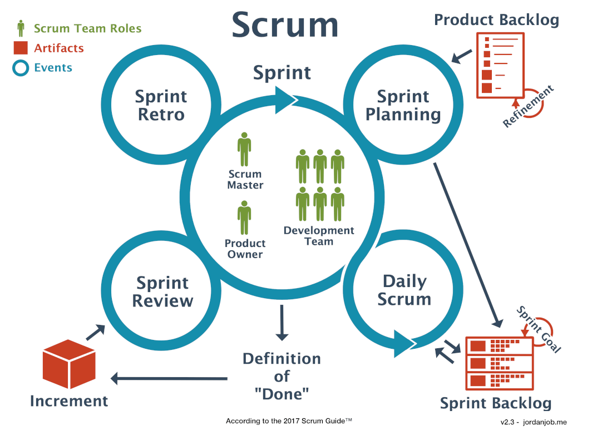

# 2.1 Projektmethode

Dieses Projekt wird mit Scrum als Projektmethode umgesetzt. Erweitert und unterstützt wird Scrum mit dem SAFe-Framework. Scrum ist eine agile Projektmethode, welche Aufgaben in kleine inkrementelle Schritte unterteilt.

Ein Grund, warum ich Scrum für dieses Projekt gewählt habe ist die hohe Flexibilität. Durch die Verwendung von mehreren Sprints und reviews, retros und plannings liefert scrum immer ein klaren Status über das Projekt. Auch kann dank den mehreren Reviews immer wieder auf Feedback von Stakeholder zurückgegriffen werden.

Folgende Abbildung erläutert die agile Projektmethode Scrum:

## Sprint

Ein Sprint ist das Herzstück der Agilität von Scrum. Ein Sprint ist ein Zeitabschnitt von vier Wochen. Zum Sprint gehören folgende Abschnitte:

- Sprint Planning
- Scrum Daily
- Sprint Review
- Sprint Retro

Diese Abschnitte unterstützen den Sprint und regeln den Ablauf und die Qualität

## Sprint Planning

Das Sprint Planning ist ein Teil des Sprints. Darin Werden Tasks vom Product Backlog in das aktuelle Sprint Backlog geschoben. Alle Ticket im Sprint Backlog müssen während dem Sprint abarbeitet werden. Das Agile Team gibt zu diesen Tasks sein commitment.

## Daily Scrum

Das Daily Scrum ist ein tägliches Meeting, welches immer zur gleichen Zeit stattfindet. Es unterstützt das Team auf mögliche Probleme hinzuweisen und den Status des Sprints einzusehen. Jede Person soll in wenigen Sätzen folgende Fragen beantworten:

- Was habe ich gestern gemacht?
- Wo gibt/gab es Probleme?
- Was werde ich heute erledigen?

Jedes Teammitglied soll die Fragen kurz und knapp beantworten. Das ganze Meeting sollte nicht länger als 15 Minuten dauern. Das Daily wird informell geführt und es wird kein Protokoll geführt.

Für dieses Projekt wird auf das Daily Scrum Meeting verzichtet, da nicht täglich am Projekt gearbeitet wird.

## Sprint Review

Das Sprint Review findet jeweils am Ende des Sprints statt. In diesem Meeting wird der Mehrwert des Sprints den Stakeholder präsentiert. Auch wird geschaut, ob alle Task im Sprint abgearbeitet werden konnten.

## Sprint Retro

Das Sprint Reto ist ein Medium in welchem sich das Scrum Team reflektieren kann. Darin sollten jedes Teammitglied etwas dazu beitragen. Kernpunkte in diesem Meeting sind:

- Keep / Beibehalten
  - Was soll beibehalten werden?
- Drop / Stopp
  - Mit was sollen wir aufhören?
- Try / Ausprobieren
  - Was sollen wir im nächsten Sprint ausprobieren?
  - Wie können wir uns verbessern?
