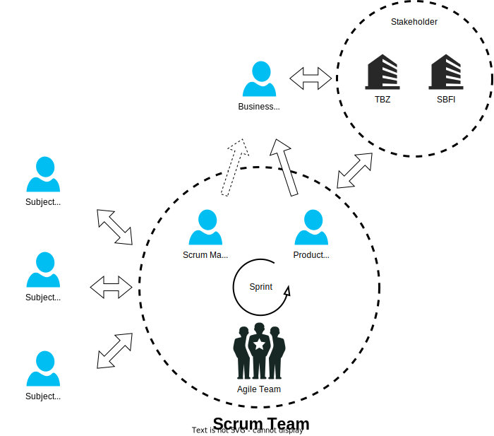

# 2.2 Projektorganisation

Diese Arbeit wird in einer agilen Umfeld durchgeführt. Dadurch gibt es keine klassische Hierarchien. In der nachfolgenden Grafik wird aufgezeigt, wie das agile Projekt aufgebaut ist.

## 2.2.1 Rollenbeschreibung

In diesem Agilen Umfeld wurden folgende Rollen definiert.

### Business Owner (BO)

Der Business Owner ist eine Schlüsselfigur und hat einen Massgebenden Einfluss auf die Semesterarbeit. Er ist Verantwortlich für das Business, anders gesagt der Outcome. Er managed mit anderen Stakeholder die Requirements und gibt diese weiter and den Product Owner, welcher die Anforderungen mit seinem Agilen Team plant und umsetzt.

**Tätigkeiten:**

- Führen des Business als Vorbild
- Finanzierung des Improvement Prozesses
- Umsetzen von Business Outcomes
- Setzen & Abstimmen von Prioritäten mit den Agilen Teams
- Präsentiert die Roadmap für das PI-Planning

### Product Owner (PO)

Der Product Owner ist ein Teammitglied im Agilen Team. Er schaut darauf, dass die Requirements, welche vom Business Owner kommen umgesetzt werden und, dass Mehrwert generiert wird. Sein Kerngedanke ist dabei immer auf die Sicht des Kunden gerichtet.

**Tätigkeiten:**

- Feedback abholen und geben
- Sich mit dem Kunden austauschen
- Mehrwert beitragen zur Business Vision und Roadmap
- Verwaltung des Backlogs und die Priorisierung
- Unterstützen der Engineers im Agilen Team

### Scrum Master

Der Scrum Master ist der Coach des Agilen Teams. Er führt das Team und vertritt dessen Meinung nach aussen. Er ist der Mentor des Teams im Bereich des Agilen Arbeiten.

**Tätigkeiten:**

- Unterstützt die Ausführung der Sprints
- Baut Hochleistungsteams
- Unterstützt mit Agilen Prinzipien

### Subject Matter Expert (SME)

Ein "Subject Matter Expert" verfügt über ein grosses Fachwissen in einem Teilbereich. Dieses Fachwissen wird im Agilen Scrum Team benötigt. Somit ist der Subject Matter Expert ein Fachexperte in seinem Fach.

### Agile Team

Ein Agiles Team ist ein Zusammenschluss von Fachpersonen (Work Force), Scrum Master und Product Owner. Sie bilden zusammen ein Team und erledigen die Tägliche Arbeit zusammen.
