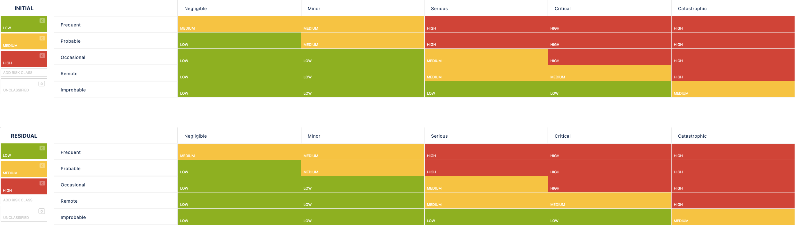
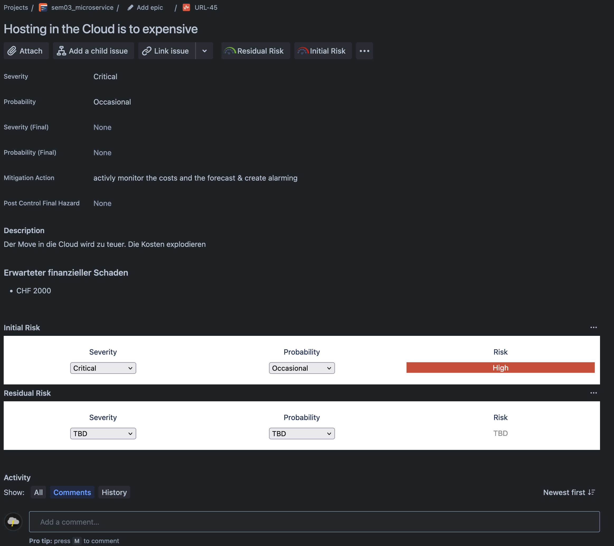
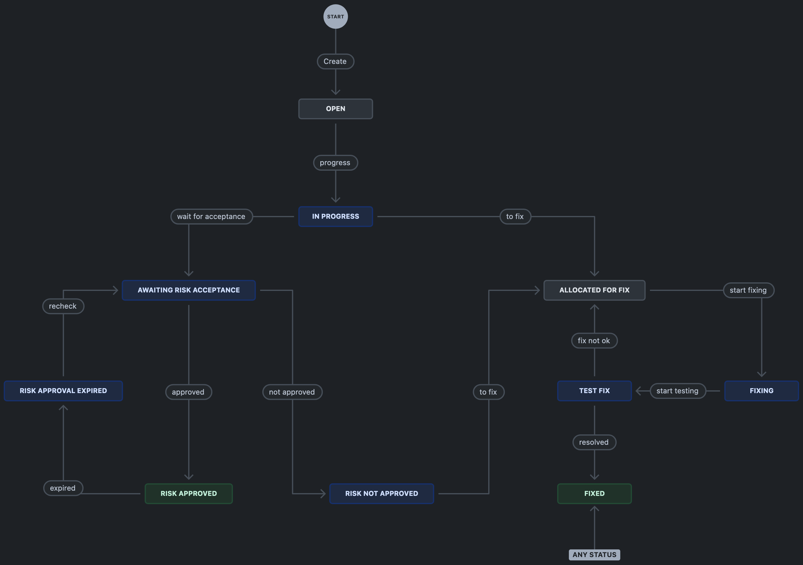

# 2.6 Risikomanagement

Für diese Semesterarbeit wird bereits Jira von Atlassian für die Projektplanung eingesetzt. Die robuste Jira-Software ermöglicht es, einen zusätzlichen "Issue-Typ" für Risiken zu erstellen. Dadurch kann das Risiko optimal mit anderen Aktivitäten verknüpft werden. Zusätzlich wurde Jira mit der App "Risk Manager" von SoftComply erweitert. Dies ermöglicht es, das Risiko in Tabellenform oder als Risiko-Grafik einzusehen.

## Risk Kategorien

Die Risiken werden nach der Eintrittswahrscheinlichkeit und der Auswirkung eingeschätzt. Je nachdem, wie der Risk eingeschätzt wird, ist die Klassifizierung unterschiedlich. Wenn die Wahrscheinlichkeit hoch und die Auswirkung hoch ist, wird das Ticket die Risiko-Klasse "High" haben. Die Einschätzung wird initial durch den Melder vorgenommen und später nach der Abschwächung, wenn Gegenmassnahmen gemacht wurden. Also eine Abschätzung des Restrisikos.

    
Beispiel eines Risikos

    

### Eintrittswahrscheinlichkeit Kategorien

- Frequent / Häufig
- Probable / Wahrscheinlich
- Occasional / Gelegentlich
- Remote / Fern
- Improbable / Unwahrscheinlich

### Auswirkung Kategorien

- Negligible / Vernachlässigbar
- Minor / Klein
- Serious / Schwer
- Critical / Kritisch
- Catastrophic / Sehr Kritisch

## Risk flow

Damit die Risiken optimal getrackt werden können, wurde ein "Flow" für den Issue-Typ "RISK" hinterlegt. Dieser ermöglicht es, dass die Risiken optimal bearbeitet werden können und ermöglichen, dass jederzeit ein aktueller Status des Risikos einsehbar ist.

Wenn ein Risiko eröffnet wird, erhält es automatisch den Status OPEN zugewiesen. Somit taucht das Ticket beim Product-Owner auf und er kann sich das Risiko anschauen und den Inhalt überprüfen und mit dem Eröffner besprechen kann. Bei seiner Arbeit wird das Ticket dann in den Status IN-Progress geschoben. Danach entscheidet er in seinem Bereich, ob er das Risiko beheben kann oder nicht. Falls er das Risiko selbst beheben oder es durch einen Lieferanten fixen lässt, so kann das Ticket direkt to Allocated for Fix und später in die Sprints mitgenommen werden. Falls er sich nicht sicher ist, ob er das Risiko lösen kann, so wird das Ticket dem Business-Owner gegeben. Dort können die Risiken in dem dazugehörigen Sync besprochen werden und das weitere Vorgehen bestimmt werden.

## Risk Managing Process

Die Risiken werden im wöchentlichen PO-Sync zusammen mit dem Business-Owner besprochen und bewertet. Somit ist sichergestellt, dass die Risiken richtig getrackt werden können. Zusammen mit der Risiko-Matrix, welche automatisch mit allen Risiko-Issues erstellt werden kann in diesem Sync immer über alle Risiken geschaut werden. Zusätzlich können die Risiken in einer Tabelle angeschaut, oder in diversen Formaten exportiert werden.
