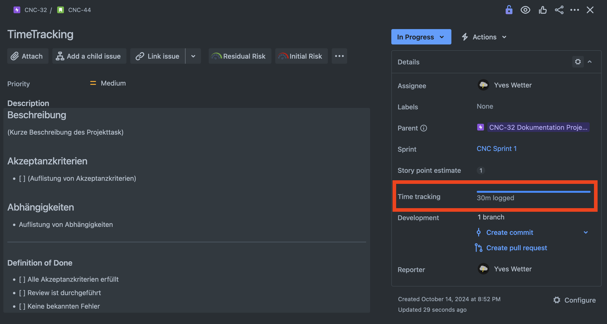
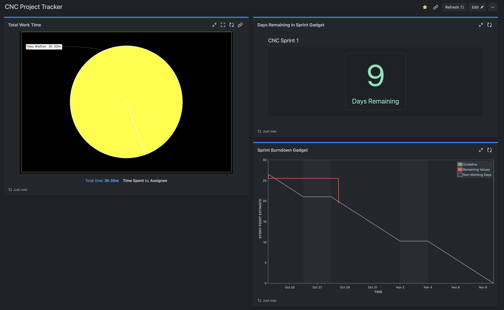

# 2.7 Zeiterfassung

Für diese Semesterarbeit wird Jira von Atlassian für die Projektplanung und das Zeitmanagement eingesetzt. Die robuste Jira-Software ermöglicht es, Arbeitszeiten präzise zu erfassen und zu verwalten. Dies wird durch die Funktion "Log Work" unterstützt, die es erlaubt, die geleisteten Arbeitsstunden direkt in den jeweiligen Tickets zu protokollieren.

## Beispiel eines "Log Work" Eintrags

## Vorteile der Zeiterfassung mit Jira

- **Transparenz**: Alle Teammitglieder können die geleisteten Arbeitsstunden einsehen, was die Transparenz im Projekt erhöht.
- **Berichterstattung**: Die erfassten Arbeitszeiten können für Berichte und Analysen genutzt werden, um den Projektfortschritt zu überwachen.
- **Effizienz**: Durch die genaue Erfassung der Arbeitszeiten können Engpässe und ineffiziente Prozesse identifiziert und optimiert werden.

## Fazit

Die Nutzung der "Log Work" Funktion in Jira ermöglicht eine präzise und transparente Erfassung der Arbeitszeiten für diese Semesterarbeit. Dies trägt wesentlich zur erfolgreichen Projektplanung und -durchführung bei. Darüber hinaus bietet Jira die Möglichkeit, benutzerdefinierte Boards zu erstellen, die es ermöglichen, den Status der Aufgaben perfekt zu tracken und somit den Überblick über den Projektfortschritt zu behalten.

Für dieses Projekt wurde ein custom Board erstellt, um den Status des Projekt gut in Augen zu behalten:

