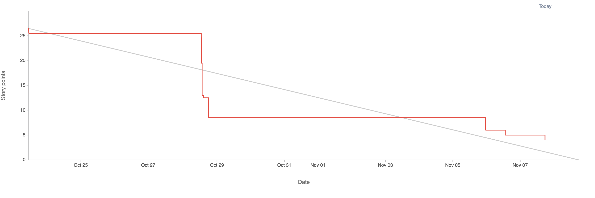

# 2.8.3 Sprint Review

## Review Sprint Ziele

| **Sprint Ziel**                 | **Status** |
| ------------------------------- | ---------- |
| Project Start                   | 100%       |
| Create RISK Board               | 100%       |
| Projectmanagement Documentation | 100%       |
| Create Service Design           | 100%       |
| Compare K8s vs NAS              | 100%       |
| Define K8s Distribution         | 100%       |
| Define K8s Storage Solution     | 100%       |

## Status Project Board

| **Total Tickets** | **Abgeschlossene Tickets** | **Nicht abgeschlossene Tickets** | **Prozentsatz** |
| :---------------: | -------------------------- | -------------------------------- | --------------- |
|        27         | 26                         | 1                                | 96.29%          |

| **Total Storypoints** | **Abgeschlossene Storypoints** | **Nicht abgeschlossene Storypoints** | **Prozentsatz** |
| :-------------------: | ------------------------------ | ------------------------------------ | --------------- |
|         26.5          | 22.5                           | 4                                    | 84.90%          |

## Anpassungen am Projekt?

Es werden keine Anpassungen am Projekt vorgenommen.

## Notizen / Anmerkungen

Der Sprint 01 war sehr erfolgreich, da alle Sprintziele zu 96.29% erreicht wurden. Diese Ziele umfassten den Projektstart, die Erstellung eines RISK Boards, die Dokumentation des Projektmanagements, die Erstellung eines Service Designs, den Vergleich von Kubernetes mit NAS, die Definition der Kubernetes-Distribution und die Definition der Kubernetes-Speicherlösung.

Das Projektboard zeigt, dass von insgesamt 27 Tickets 26 abgeschlossen wurden, was einer Erfolgsrate von 96.29% entspricht. Von den insgesamt 26.5 Storypoints wurden 22.5 abgeschlossen, was einer Erfolgsrate von 84.90% entspricht.

Somit gab es nur ein nicht abgeschlossenes Ticket und einige nicht abgeschlossene Storypoints. Leider benötigte die Erstellung und Dokumentation des Service Design mehr Zeit als angenommen. Somit konnte leider noch nicht mit dem K8s setup gestartet werden. Dies ist jedoch nicht weiter schlimm und wird als Spillover im nächsten Sprint übernommen.

---

- [GIT Repository Tag - Sprint01](https://github.com/Cloud-native-engineering/sem04_docs/releases/tag/sprint-01)
- [Jira Board](https://itcne23.atlassian.net/jira/software/projects/CNC/boards/5)
- [Jira Sprint Tickets](https://itcne23.atlassian.net/jira/software/projects/CNC/issues/CNC-32?jql=project%20%3D%20%22CNC%22%20AND%20sprint%20%3D%2010%20ORDER%20BY%20created%20DESC)
- [Jira Epics](https://itcne23.atlassian.net/jira/software/projects/CNC/issues/CNC-32?jql=project%20%3D%20%22CNC%22%20AND%20sprint%20%3D%2010%20AND%20type%20%3D%20Epic%20ORDER%20BY%20created%20DESC)
- [Jira Backlog](https://itcne23.atlassian.net/jira/software/projects/CNC/boards/5/backlog)
