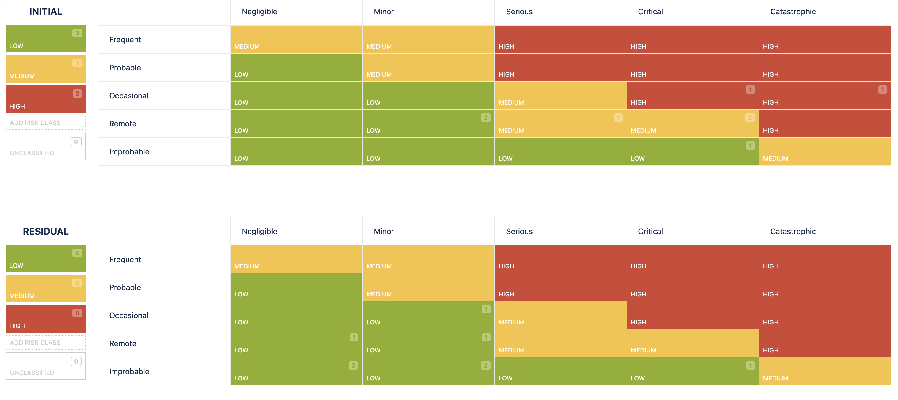

# 2.8.5 Riskboard Meeting

Im Riskboard Meeting wird über die aktuellen Risiken des Projekts. Betrachtet werden die anfänglichen Auswirkungen und Wahrscheinlichkeiten dieser Risiken und gefolgt von einer gründlichen Diskussion. Anschliessend schätzen die Teilnehmer des Riskboards das Risiko ein und planen entsprechende Gegenmassnahmen.

| **Total Risks** | **Low Risks** | **Medium Risks** | **High Risks** |
| :-------------: | ------------- | ---------------- | -------------- |
|     8           | 3             | 3                | 2              |

- [Risiko Tabelle](https://itcne23.atlassian.net/projects/CNC?selectedItem=com-softcomply-riskmanager-cloud__risk-table-link&ac.filter=)

## Neu Risiken

Da dies das erste Riskmeeting ist, wurden alle Risiken als neu betrachtet. Besonderes Augenmerk lag auf den Risiken mit der initialen Risikostufe "hoch".

- **CNC-52 - Change of Scope**
  - Gegenmassnahmen: Regelmässiger Austausch mit Stakeholdern

- **CNC-50 - Datenverlust der Dokumentation**
  - Gegenmassnahmen: Datenspeicherung in OneDrive & GitHub Remote Repository

- **CNC-56 - Git Provider nicht kompatibel mit TigOps Tooling**
  - Gegenmassnahmen: Keine, im Notfall wird der Git-Remote Provider gewechselt. Da Git und GitHub oder GitLab sehr verbreitet sind in Enterprise Environments, werden keine Probleme erwartet.

- **CNC-58 - Hardwarebeschränkungen**
  - Gegenmassnahmen: Einbezug in die Evaluation und höhere Gewichtung

- **CNC-55 - K8s Storage Performance langsam**
  - Gegenmassnahmen: Einbezug in die Evaluation und in das Testing

- **CNC-54 - Know-How-Limitation in K8s**
  - Gegenmassnahmen: Timeboxing für Lernprozess und Einbezug von Zeitpuffern

- **CNC-51 - Nicht genug Zeit für die Implementierung**
  - Gegenmassnahmen: Gezieltes Timeboxing im Kalender und in der Planung

- **CNC-53 - Storage Provider funktioniert nicht mit K8s Distro**
  - Gegenmassnahmen: Einbezug in die Evaluation und höhere Gewichtung

## Update zu Risiken

Da alle Risiken neu waren, gab es noch keine Updates.
