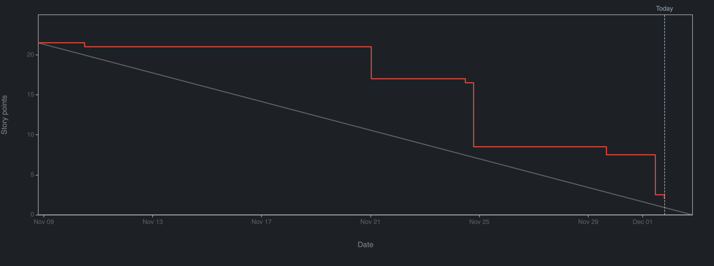

# 2.9.3 Sprint Review

## Review Sprint Ziele

| **Sprint Ziel**         | **Status** |
| ----------------------- | ---------- |
| Sprint02 Administration | 100%       |
| Setup K8s               | 97%        |
| Setup K8s Base          | 100%       |
| Setup ArgoCD            | 100%       |
| Setup Longhorn          | 100%       |

## Status Project Board

| **Total Tickets** | **Abgeschlossene Tickets** | **Nicht abgeschlossene Tickets** | **Prozentsatz** |
| :---------------: | -------------------------- | -------------------------------- | --------------- |
|        12         | 11                         | 1                                | 92%             |

| **Total Storypoints** | **Abgeschlossene Storypoints** | **Nicht abgeschlossene Storypoints** | **Prozentsatz** |
| :-------------------: | ------------------------------ | ------------------------------------ | --------------- |
|         21.5          | 19.5                           | 2                                    | 90.7%           |

## Anpassungen am Projekt?

Es Wurde entschieden, dass Longhorn-Setup auch via ArgoCD zu managen. Grund dazu war, einen zukünftigen Versionupgrade zu vereinfachen.

## Notizen / Anmerkungen

Sprint 02 war äusserst erfolgreich, da fast alle Tickets abgeschlossen werden konnten. Obwohl es im Vergleich zum vorherigen Sprint weniger Tickets gab, umfasste Sprint 2 eine grössere Anzahl an Story-Punkten. Dieser Sprint war technisch anspruchsvoll und ermöglichte die Fertigstellung der Kubernetes-Clusterinstallation.

Die Arbeiten begannen mit der Informationsbeschaffung über den Talos Kubernetes Cluster. Es musste viel recherchiert werden, da Talos ein unveränderliches Linux ist und keine Plugins mittels SSH installiert werden können. Daher musste im Base-Setup eine GitHub Actions Pipeline integriert werden, um das iSCSI-Plugin und die Kernel-Erweiterungen für die RK1 Compute-Module zu erstellen. Diese Pipeline erstellt ein OCI-Image und veröffentlicht es auf GitHub Packages, sodass der Cluster dieses Image als Quelle verwenden kann. Zusätzlich wurden viele Arbeiten für das Base-Setup erledigt, wie IP, DNS, VIP und Konnektivität.

Es gab nur ein Spill-over. Der Cert-Manager konnte noch nicht installiert werden, da die Zeit nicht gereicht hat. Stattdessen wurde das Longhorn-Setup als Proof of Concept (POC) mit einer Demo-Applikation getestet. Dies war in der ursprünglichen Planung nicht vorgesehen, daher wurde diese Story in den nächsten Sprint verschoben.

---

- [GIT Repository Tag - Sprint02](https://github.com/Cloud-native-engineering/sem04_docs/releases/tag/sprint-02)
- [Jira Board](https://itcne23.atlassian.net/jira/software/projects/CNC/boards/5)
- [Jira Sprint Tickets](https://itcne23.atlassian.net/jira/software/projects/CNC/issues/CNC-32?jql=project%20%3D%20%22CNC%22%20AND%20sprint%20IN%20%2810%2C%2011%29%20ORDER%20BY%20created%20DESC)
- [Jira Epics](https://itcne23.atlassian.net/jira/software/projects/CNC/issues/CNC-32?jql=project%20%3D%20%22CNC%22%20AND%20sprint%20%3D%2010%20AND%20type%20%3D%20Epic%20ORDER%20BY%20created%20DESC)
- [Jira Backlog](https://itcne23.atlassian.net/jira/software/projects/CNC/boards/5/backlog)
