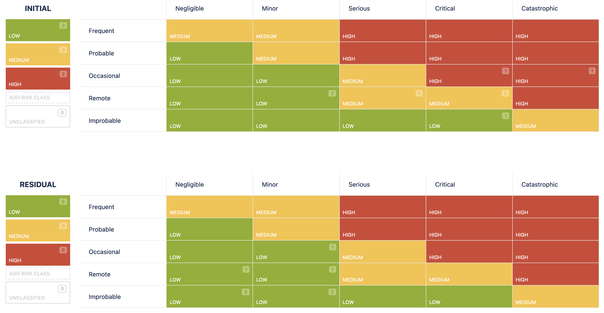

# 2.9.5 Riskboard Meeting

Im Riskboard Meeting werden die aktuellen Risiken des Projekts besprochen. Dabei werden die anfänglichen Auswirkungen und Wahrscheinlichkeiten dieser Risiken betrachtet und gründlich diskutiert. Anschließend schätzen die Teilnehmer des Riskboards das Risiko ein und planen entsprechende Gegenmaßnahmen.

| **Total Risks** | **Low Risks** | **Medium Risks** | **High Risks** |
| :-------------: | ------------- | ---------------- | -------------- |
|        7        | 7             | 0                | 0              |

- [Risiko Tabelle](https://itcne23.atlassian.net/projects/CNC?selectedItem=com-softcomply-riskmanager-cloud__risk-table-link&ac.filter=)

## Neue Risiken

- Keine neuen Risiken

## Updates zu Risiken

Alle Risiken wurden in Jira aktualisiert und mit Kommentaren ergänzt.

- CNC-53: Storage Provider does not work with immutable K8s
  - Status: FIXED
  - Das Risiko wurde eliminiert, da ein kleiner POC im Projekt gezeigt hat, dass Longhorn mit Talos Linux funktioniert.
