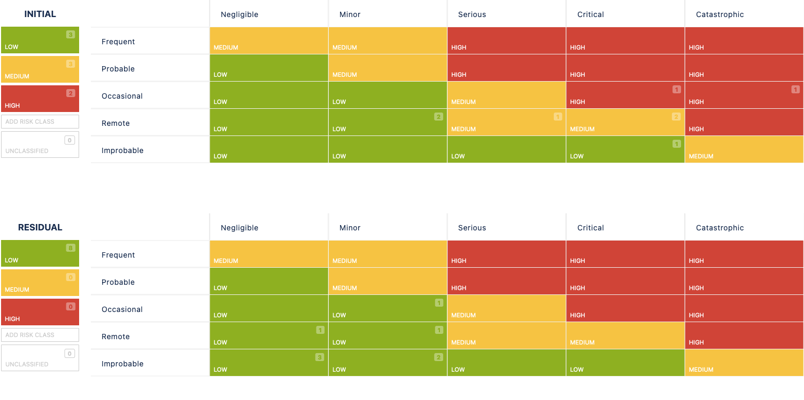

# 2.10.5 Riskboard Meeting

Im Riskboard Meeting wird über die aktuellen Risiken des Projekts. Betrachtet werden die anfänglichen Auswirkungen und Wahrscheinlichkeiten dieser Risiken und gefolgt von einer gründlichen Diskussion. Anschliessend schätzen die Teilnehmer des Riskboards das Risiko ein und planen entsprechende Gegenmassnahmen.

| **Total Risks** | **Low Risks** | **Medium Risks** | **High Risks** |
| :-------------: | ------------- | ---------------- | -------------- |
|       ??        | ??            | ??               | ??             |

- [Risiko Tabelle](https://itcne23.atlassian.net/projects/CNC?selectedItem=com-softcomply-riskmanager-cloud__risk-table-link&ac.filter=)

## Neu Risiken

Da dies das erste Riskmeeting ist, wurden alle Risiken als neu betrachtet. Besonderes Augenmerk lag auf den Risiken mit der initialen Risikostufe "hoch".

> TBD

## Update zu Risiken

> TBD
