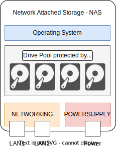
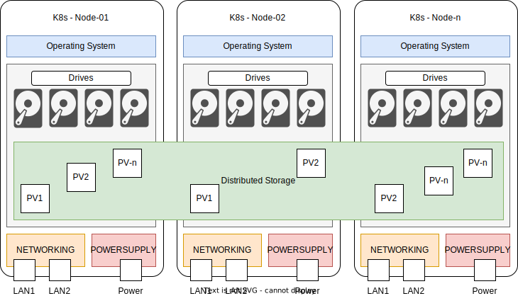
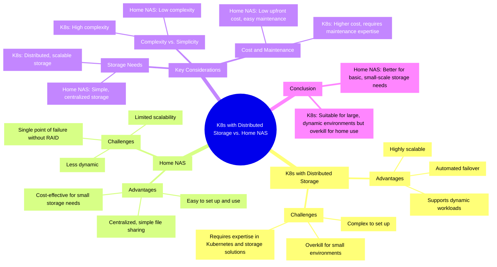

# 3. K8s vs. NAS

Ziel dieser Analyse ist es, die Stärken und Schwächen von Kubernetes (K8s) im Vergleich zu herkömmlichen NAS-Systemen herauszuarbeiten. Dabei sollen sowohl Leistung und Skalierbarkeit als auch Benutzerfreundlichkeit und Kosten berücksichtigt werden. Durch einen detaillierten Vergleich soll ermittelt werden, in welchen Anwendungsbereichen K8s eine sinnvolle Alternative zu NAS darstellen kann.

## Network Attached Storage - NAS

Network Attached Storage (NAS) ist eine Speicherlösung, die über ein Netzwerk zugänglich ist und es mehreren Benutzern ermöglicht, Daten zentral zu speichern und abzurufen. NAS-Systeme sind in der Regel einfach einzurichten und zu verwalten und bieten eine kostengünstige Lösung für kleine bis mittlere Speicheranforderungen.

### Vorteile und Herausforderungen von NAS

| Vorteile                                                                                                                                                                                  | Herausforderungen                                                                                                                                 |
| ----------------------------------------------------------------------------------------------------------------------------------------------------------------------------------------- | ------------------------------------------------------------------------------------------------------------------------------------------------- |
| **Einfache Einrichtung und Nutzung**: NAS-Systeme sind benutzerfreundlich und erfordern keine tiefgehenden technischen Kenntnisse für die Installation und Verwaltung.                    | **Begrenzte Skalierbarkeit**: NAS-Systeme sind oft durch die Hardware begrenzt und können nicht so einfach skaliert werden wie verteilte Systeme. |
| **Zentralisierte, einfache Dateifreigabe**: NAS ermöglicht es mehreren Benutzern, auf gemeinsame Daten zuzugreifen, was die Zusammenarbeit erleichtert.                                   | **Weniger dynamisch**: NAS ist weniger flexibel bei der Anpassung an wechselnde Arbeitslasten und Anforderungen.                                  |
| **Kosteneffektiv für kleine Speicheranforderungen**: NAS-Systeme sind in der Regel günstiger in der Anschaffung und Wartung, was sie ideal für kleine Unternehmen und Heimanwender macht. | **Einzelner Fehlerpunkt ohne RAID**: Ohne RAID-Konfiguration kann ein NAS-System bei einem Hardware-Ausfall zu Datenverlust führen.               |

## Kubernetes mit Distributed Storage

Kubernetes (K8s) mit verteiltem Speicher ist eine Container-Orchestrierungsplattform, die es ermöglicht, Anwendungen in Containern zu verwalten und zu skalieren. Durch die Integration von verteiltem Speicher können Daten über mehrere Knoten hinweg gespeichert und verwaltet werden, was eine hohe Verfügbarkeit und Skalierbarkeit ermöglicht.

### Vorteile und Herausforderungen von Kubernetes mit Distributed Storage

| Vorteile                                                                                                                                                             | Herausforderungen                                                                                                                                                  |
| -------------------------------------------------------------------------------------------------------------------------------------------------------------------- | ------------------------------------------------------------------------------------------------------------------------------------------------------------------ |
| **Hohe Skalierbarkeit**: Kubernetes ermöglicht es, Ressourcen dynamisch zuzuweisen und Anwendungen automatisch zu skalieren, um den Anforderungen gerecht zu werden. | **Komplexe Einrichtung**: Die Einrichtung und Verwaltung von Kubernetes erfordert tiefgehende technische Kenntnisse und kann zeitaufwendig sein.                   |
| **Automatisches Failover**: Bei einem Ausfall eines Knotens kann Kubernetes automatisch auf andere Knoten umschalten, um die Verfügbarkeit zu gewährleisten.         | **Überdimensioniert für kleine Umgebungen**: Für kleine Unternehmen oder Heimanwender kann Kubernetes überdimensioniert und unnötig komplex sein.                  |
| **Unterstützt dynamische Arbeitslasten**: Kubernetes kann sich an wechselnde Arbeitslasten anpassen und bietet eine flexible Lösung für komplexe Anwendungen.        | **Erfordert Fachwissen in Kubernetes und Speicherlösungen**: Die Verwaltung von Kubernetes und verteiltem Speicher erfordert spezialisiertes Wissen und Erfahrung. |

## Vergleich von Kubernetes (K8s) und NAS-Systemen

## Vergleich der Verfügbarkeit von Kubernetes (K8s) und NAS-Systemen

Einer der wichtigsten Unterschiede der beiden Setups ist die Verfügbarkeit und Redundanz der einzelnen Komponenten.

| Kriterium                               | Kubernetes (K8s) mit verteiltem Speicher | Home NAS                        |
| --------------------------------------- | ---------------------------------------- | ------------------------------- |
| **Redundanz auf Festplattenebene**      | Ja, konfigurierbar für jedes PV          | Ja, mit RAID                    |
| **Redundanz auf CPU-Ebene**             | Ja, mehrere Knoten möglich               | Nein                            |
| **Redundanz auf RAM-Ebene**             | Ja, mehrere Knoten möglich               | Nein                            |
| **Redundanz auf Betriebssystemebene**   | Ja, mehrere Knoten möglich               | Nein                            |
| **Redundanz auf Stromversorgungsebene** | Ja, mit entsprechender Hardware          | Nein, abhängig von NAS-Hardware |
| **Redundanz auf Netzwerkebene**         | Ja, mit entsprechender Hardware          | Nein, abhängig von NAS-Hardware |
| **Automatisches Failover**              | Ja, integriert                           | Nein                            |
| **Skalierbarkeit**                      | Hoch, dynamisch                          | Begrenzt                        |
| **Komplexität**                         | Hoch, erfordert Expertise                | Niedrig, einfach einzurichten   |
| **Kosten**                              | Höher, erfordert mehr Ressourcen         | Niedrig, kostengünstig          |
| **Wartungsaufwand**                     | Hoch, erfordert Fachwissen               | Gering, einfach zu warten       |

## Fazit

Grundsätzlich kann gesagt werden, dass beide Lösungen für die Speicherung der eigenen Daten im eigenen Haus geeignet sind. Je nach gewähltem Setup variiert die Verfügbarkeit der Speicherlösung. Auf der grundlegenden Ebene der Verfügbarkeit können beide Systeme den Verlust einer Festplatte überstehen. Ein Kubernetes-Setup bietet jedoch die Möglichkeit, für jeden Anwendungsfall festzulegen, welche Redundanz ein Persistent Volume (PV) erhalten soll. Somit kann der verfügbare Speicherplatz besser auf die Bedürfnisse abgestimmt genutzt werden. Das Setup mit Kubernetes kann zudem Redundanz auf den Ebenen CPU, RAM und Betriebssystem bieten und kann auch auf die Stromversorgung und Netzwerkebene ausgeweitet werden.

Beide Setups bieten eine Verfügbarkeit auf Festplattenebene. Dennoch sollte immer auf die 3-2-1-Backup-Strategie zurückgegriffen werden. Das Kubernetes-Setup ermöglicht bereits die Erstellung mehrerer Kopien. Was jedoch bei beiden Systemen fehlt, ist ein Off-Site-Backup, das Schutz vor lokalen oder regionalen Katastrophen bietet.

Schlussendlich wird das Kubernetes-Setup umgesetzt. Der Kernpunkt ist der Lernprozess und die Tatsache, dass der TuringPi eine optimale Grundlage dafür bietet.
