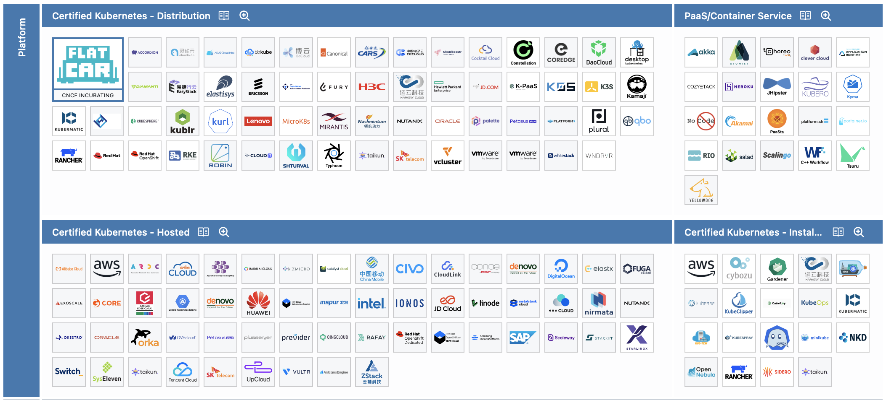

# 4.2 Kubernetes Dirstibution

Die Auswahl einer Distribution, sei es bei Linux oder bei einer Kubernetes-Distribution, erfordert ähnliche Überlegungen. Es ist wichtig, die Zielgruppe der Lösung zu berücksichtigen. Für Heimanwender kann es wichtiger sein, schnell neue Features zu testen und zu erhalten. Im geschäftlichen Umfeld stehen hingegen Stabilität und die Behebung von Sicherheitslücken im Vordergrund.

## Distributionen

Die Liste der zu evaluierenden Kubernetes-Distributionen umfasst sowohl etablierte als auch neue Projekte, die von der Cloud Native Computing Foundation unterstützt werden. Von der Evaluation ausgeschlossen sind Kubernetes-Distributionen, die von Cloud-Providern gewartet werden, da diese in der Regel ausschliesslich in der Cloud betrieben werden können.

Die Vielzahl der Kubernetes-Distributionen auf der [Cloud Native Landscape](https://landscape.cncf.io/?group=certified-partners-and-providers) ist enorm, und es ist unmöglich, alle zu evaluieren.

### MicroK8s von Canonical

MicroK8s ist eine leichtgewichtige, integrierbare Kubernetes-Distribution, die von Canonical entwickelt wurde. Sie ist einfach zu installieren und zu verwalten und eignet sich gut für lokale Entwicklungsumgebungen und kleine Produktionsumgebungen.

| **Kriterium**              | **Details**                                                                 |
|----------------------------|-----------------------------------------------------------------------------|
| **Entwickler**             | Canonical                                                                   |
| **Zielgruppe**             | Entwickler, kleine Teams, lokale Entwicklungsumgebungen                     |
| **Installation**           | Einfach                                                                     |
| **Skalierbarkeit**         | Hoch                                                                      |
| **Sicherheit**             | Mittel                                                                      |
| **Support**                | Community-Support, kommerzieller Support durch Canonical                    |
| **Kosten**                 | Kostenlos, kommerzieller Support kostenpflichtig                            |

### RedHat OpenShift

OpenShift ist eine Kubernetes-Distribution von Red Hat, die umfassende Funktionen für Unternehmen bietet, einschliesslich integrierter CI/CD-Pipelines, Sicherheitsfunktionen und einer benutzerfreundlichen Web-Oberfläche. OpenShift ist ideal für grosse Unternehmen, die eine robuste und skalierbare Lösung benötigen.

| **Kriterium**              | **Details**                                                                 |
|----------------------------|-----------------------------------------------------------------------------|
| **Entwickler**             | Red Hat                                                                     |
| **Zielgruppe**             | Unternehmen, grosse Teams, Produktionsumgebungen                             |
| **Installation**           | Mittel                                                                      |
| **Skalierbarkeit**         | Hoch                                                                        |
| **Sicherheit**             | Hoch                                                                        |
| **Support**                | Professioneller Support durch Red Hat                                       |
| **Kosten**                 | Kostenpflichtig, kostenlose Nutzung mit Developer Subscription gemäss AGBs   |

### K3s von SUSE

K3s ist eine leichtgewichtige Kubernetes-Distribution, die von Rancher Labs (jetzt Teil von SUSE) entwickelt wurde. Sie ist speziell für Edge-Computing und IoT-Anwendungen konzipiert und bietet eine einfache Installation und Verwaltung.

| **Kriterium**              | **Details**                                                                 |
|----------------------------|-----------------------------------------------------------------------------|
| **Entwickler**             | Rancher Labs (SUSE)                                                         |
| **Zielgruppe**             | Entwickler, kleine Teams, Edge-Computing, IoT                               |
| **Installation**           | Einfach                                                                     |
| **Skalierbarkeit**         | Mittel                                                                      |
| **Sicherheit**             | Mittel                                                                      |
| **Support**                | Community-Support, kommerzieller Support durch SUSE                         |
| **Kosten**                 | Kostenlos, kommerzieller Support kostenpflichtig                            |

### Talos Linux von Sidero Labs

Talos Linux ist ein speziell für Kubernetes entwickeltes Betriebssystem, das von Sidero Labs entwickelt wurde. Es bietet eine hohe Sicherheit und Automatisierung und ist ideal für komplexe Infrastrukturen und erfahrene Benutzer.

| **Kriterium**              | **Details**                                                                 |
|----------------------------|-----------------------------------------------------------------------------|
| **Entwickler**             | Sidero Labs                                                                 |
| **Zielgruppe**             | Erfahrene Benutzer, komplexe Infrastrukturen                                |
| **Installation**           | Komplex                                                                     |
| **Skalierbarkeit**         | Hoch                                                                        |
| **Sicherheit**             | Hoch                                                                        |
| **Support**                | Community-Support, kommerzieller Support durch Sidero Labs                  |
| **Kosten**                 | Kostenlos, kommerzieller Support kostenpflichtig                            |

### K0s von Mirantis

K0s ist eine leichtgewichtige Kubernetes-Distribution, die von Mirantis entwickelt wurde. Sie ist einfach zu installieren und zu betreiben und eignet sich gut für lokale Entwicklungsumgebungen und kleine Teams.

| **Kriterium**              | **Details**                                                                 |
|----------------------------|-----------------------------------------------------------------------------|
| **Entwickler**             | Mirantis                                                                    |
| **Zielgruppe**             | Entwickler, kleine Teams, lokale Entwicklungsumgebungen                     |
| **Installation**           | Einfach                                                                     |
| **Skalierbarkeit**         | Mittel                                                                      |
| **Sicherheit**             | Mittel                                                                      |
| **Support**                | Community-Support, kommerzieller Support durch Mirantis                     |
| **Kosten**                 | Kostenlos, kommerzieller Support kostenpflichtig                            |

## Entscheidungsmatrix

Es können folgende Punkte von 1 bis 5 verteilt werden, wobei 5 die beste Bewertung darstellt.

| **Kriterium**                          | **MicroK8s** | **OpenShift** | **K3s**    | **Talos Linux** | **K0s**    |
| -------------------------------------- | ------------ | ------------- | ---------- | --------------- | ---------- |
| **Einfachheit der Installation**       | 5            | 3             | 5          | 4               | 5          |
| **Skalierbarkeit**                     | 3            | 5             | 4          | 5               | 4          |
| **Sicherheit**                         | 3            | 5             | 3          | 5               | 2          |
| **Unterstützung und Community**        | 4            | 5             | 4          | 3               | 2          |
| **Kosten**                             | 5            | 2             | 5          | 4               | 5          |
| **Performance**                        | 4            | 5             | 4          | 5               | 4          |
| **Flexibilität**                       | 4            | 4             | 5          | 3               | 4          |
| **Integration mit CI/CD**              | 3            | 5             | 3          | 5               | 3          |
| **Verfügbarkeit von Add-ons**          | 4            | 5             | 4          | 3               | 4          |
| **Gesamtbewertung**                    | 35           | 39            | 37         | 38              | 34         |

### Entscheidung für Talos Linux

Nach sorgfältiger Evaluierung der verschiedenen Kubernetes-Distributionen wurde entschieden, mit Talos Linux fortzufahren. Ein entscheidender Faktor war, dass bei Talos Linux alles readonly und immutable konfigurierbar ist. Sämtliche Konfigurationen können nur über die API vorgenommen werden, was die Möglichkeit, GitOps und Pipelines zu verwenden, erheblich vereinfacht. Talos Linux bietet zudem eine hohe Sicherheit und Automatisierung. Die unveränderliche Architektur von Talos Linux reduziert die Angriffsfläche und erhöht die Zuverlässigkeit des Systems. Darüber hinaus ermöglicht die Automatisierung eine effiziente Verwaltung und Skalierung des Clusters, was besonders in dynamischen Umgebungen, wie ein HomeLab von Vorteil ist.

### Ablehnung von OpenShift

Obwohl OpenShift eine umfassende und leistungsstarke Kubernetes-Distribution ist, wurde bewusst dagegen entschieden. Einer der Hauptgründe war der Wunsch, ein immutable Linux auszuprobieren. Ein weiterer Punkt war, dass OpenShift eine kostenpflichtige Subscription erfordert. Obwohl eine kostenlose Nutzung über die [RedHat Developer Subscription](https://developers.redhat.com/articles/faqs-no-cost-red-hat-enterprise-linux) möglich ist, wurde dennoch dagegen entschieden.

Darüber hinaus kann die Komplexität von OpenShift für kleinere Teams und Projekte überdimensioniert sein. Die zusätzlichen Kosten und der Verwaltungsaufwand machen OpenShift weniger attraktiv für ein HomeLab.

### Fazit

Die Entscheidung, mit Talos Linux fortzufahren, basiert auf einer Abwägung von Sicherheit, Automatisierung und Kosten. Talos Linux bietet die notwendige Sicherheit und Flexibilität, um die Infrastruktur effizient zu verwalten, während die Kosten im Rahmen bleiben. OpenShift hingegen, obwohl leistungsstark, ist aufgrund der Subscribtionkosten und der Komplexität für diese Semesterarbeit weniger geeignet.
