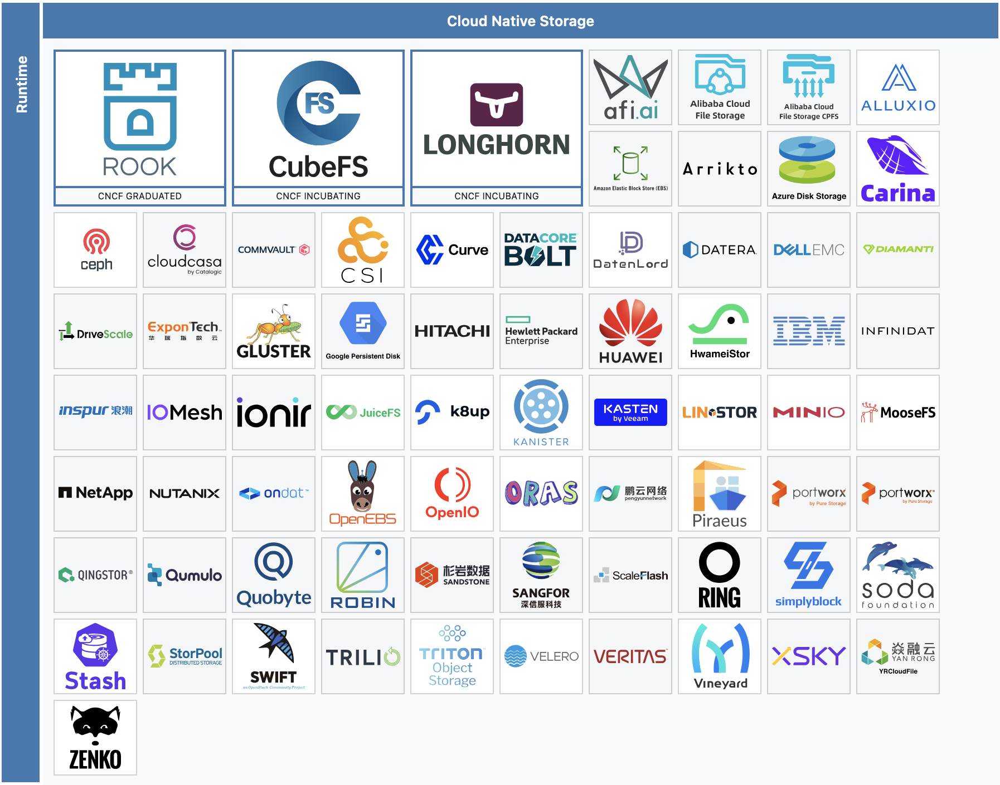

# 4.3 Distributed Storage Solution

Die Auswahl einer Distributed Storage Solution erfordert ähnliche Überlegungen wie bei der Auswahl einer Kubernetes-Distribution. Es ist wichtig, die Zielgruppe der Lösung zu berücksichtigen. Für Heimanwender kann es wichtiger sein, eine einfache und kostengünstige Lösung zu haben. Im geschäftlichen Umfeld stehen hingegen Skalierbarkeit, Zuverlässigkeit und Sicherheit im Vordergrund.

Die Liste der zu evaluierenden Distributed Storage Solutions umfasst sowohl etablierte als auch neue Projekte, die von der Cloud Native Computing Foundation unterstützt werden.

## Rook

Rook ist eine Cloud-native Storage-Orchestrierungsplattform, die verschiedene Speicherlösungen wie Ceph, Cassandra und NFS integriert. Sie bietet eine einfache Verwaltung und Skalierbarkeit und ist ideal für Kubernetes-Umgebungen. Rook ermöglicht es, Speicherressourcen in Kubernetes-Clustern zu verwalten und zu orchestrieren, indem es die nativen Kubernetes-APIs und -Tools nutzt. Es bietet eine nahtlose Integration und Automatisierung für die Bereitstellung, Verwaltung und Skalierung von Speicherlösungen.

| **Kriterium**              | **Details**                                                                 |
|----------------------------|-----------------------------------------------------------------------------|
| **Entwickler**             | Rook Community                                                              |
| **Zielgruppe**             | Entwickler, kleine Teams, lokale Entwicklungsumgebungen                     |
| **Installation**           | Einfach, mit Helm-Charts und Operator                                       |
| **Skalierbarkeit**         | Hoch, unterstützt grosse Cluster und verschiedene Speicherlösungen           |
| **Sicherheit**             | Hoch, bietet Verschlüsselung und Sicherheitsrichtlinien                     |
| **Support**                | Community-Support, kommerzieller Support durch Drittanbieter                |
| **Kosten**                 | Kostenlos, kommerzieller Support kostenpflichtig                            |

## Ceph

Ceph ist eine verteilte Speicherlösung, die für Skalierbarkeit, Leistung und Zuverlässigkeit entwickelt wurde. Es bietet objektbasierten, blockbasierten und dateibasierten Speicher und ist ideal für grosse Datenmengen und anspruchsvolle Workloads. Ceph integriert sich nahtlos in Kubernetes-Umgebungen und ermöglicht die Verwaltung von Speicherressourcen über native Kubernetes-APIs und -Tools.

| **Kriterium**              | **Details**                                                                 |
|----------------------------|-----------------------------------------------------------------------------|
| **Entwickler**             | Ceph Community                                                              |
| **Zielgruppe**             | Unternehmen, grosse Teams, produktive Umgebungen                             |
| **Installation**           | Komplex, erfordert detaillierte Konfiguration                               |
| **Skalierbarkeit**         | Sehr hoch, unterstützt grosse Cluster und verschiedene Speicherlösungen      |
| **Sicherheit**             | Hoch, bietet Verschlüsselung und Sicherheitsrichtlinien                     |
| **Support**                | Community-Support, kommerzieller Support durch Drittanbieter                |
| **Kosten**                 | Kostenlos, kommerzieller Support kostenpflichtig                            |

## GlusterFS

GlusterFS ist ein verteiltes Dateisystem, das für die Skalierung von grossen Datenmengen und die Bereitstellung von Hochverfügbarkeit entwickelt wurde. Es ist ideal für Entwickler, kleine Teams und lokale Entwicklungsumgebungen. GlusterFS bietet eine einfache Installation und Verwaltung und kann nahtlos in Kubernetes-Umgebungen integriert werden.

| **Kriterium**              | **Details**                                                                 |
|----------------------------|-----------------------------------------------------------------------------|
| **Entwickler**             | Gluster Community & Red Hat                                                 |
| **Zielgruppe**             | Entwickler, kleine Teams, lokale Entwicklungsumgebungen                     |
| **Installation**           | Einfach                                                                     |
| **Skalierbarkeit**         | Mittel                                                                      |
| **Sicherheit**             | Mittel                                                                      |
| **Support**                | Community-Support, kommerzieller Support durch Red Hat                      |
| **Kosten**                 | Kostenlos, kommerzieller Support kostenpflichtig                            |

## Longhorn

Longhorn ist eine verteilte Blockspeicherlösung für Kubernetes, die von Rancher Labs entwickelt wurde. Es bietet eine einfache Installation und Verwaltung und ist ideal für Entwickler, kleine Teams und lokale Entwicklungsumgebungen. Longhorn ermöglicht die Bereitstellung und Verwaltung von persistentem Speicher in Kubernetes-Clustern und bietet Funktionen wie Snapshotting, Backup und Wiederherstellung.

| **Kriterium**              | **Details**                                                                 |
|----------------------------|-----------------------------------------------------------------------------|
| **Entwickler**             | Rancher Labs                                                                |
| **Zielgruppe**             | Entwickler, kleine Teams, lokale Entwicklungsumgebungen                     |
| **Installation**           | Einfach, mit Helm-Charts und Operator                                       |
| **Skalierbarkeit**         | Mittel, geeignet für kleine bis mittelgrosse Cluster                         |
| **Sicherheit**             | Mittel, bietet grundlegende Sicherheitsfunktionen                           |
| **Support**                | Community-Support, kommerzieller Support durch Rancher Labs                 |
| **Kosten**                 | Kostenlos, kommerzieller Support kostenpflichtig                            |

## Portworx

Portworx ist eine Cloud-native Speicherlösung, die speziell für containerisierte Anwendungen entwickelt wurde. Es bietet eine hohe Verfügbarkeit, Datensicherung und Disaster Recovery für Kubernetes-Umgebungen. Portworx ermöglicht die Verwaltung von persistentem Speicher und bietet Funktionen wie automatische Skalierung, Verschlüsselung und Backup.

| **Kriterium**              | **Details**                                                                 |
|----------------------------|-----------------------------------------------------------------------------|
| **Entwickler**             | Pure Storage                                                                |
| **Zielgruppe**             | Unternehmen, grosse Teams, produktive Umgebungen                             |
| **Installation**           | Komplex, erfordert detaillierte Konfiguration                               |
| **Skalierbarkeit**         | Sehr hoch, unterstützt grosse Cluster und verschiedene Speicherlösungen      |
| **Sicherheit**             | Hoch, bietet Verschlüsselung und Sicherheitsrichtlinien                     |
| **Support**                | Community-Support, kommerzieller Support durch Pure Storage                 |
| **Kosten**                 | Kostenpflichtig, kommerzieller Support                                      |

## Entscheidungsmatrix

Es können folgende Punkte von 1 bis 5 verteilt werden, wobei 5 die beste Bewertung darstellt.

| **Kriterium**                          | **Rook** | **Ceph** | **GlusterFS** | **Longhorn** | **Portworx** |
| -------------------------------------- | -------- | -------- | ------------- | ------------ | ------------ |
| **Einfachheit der Installation**       | 5        | 3        | 5             | 5            | 3            |
| **Skalierbarkeit**                     | 4        | 5        | 3             | 4            | 5            |
| **Sicherheit**                         | 4        | 5        | 3             | 4            | 5            |
| **Unterstützung und Community**        | 4        | 5        | 4             | 4            | 3            |
| **Kosten**                             | 5        | 4        | 5             | 5            | 3            |
| **Performance**                        | 4        | 5        | 4             | 4            | 4            |
| **Flexibilität**                       | 4        | 4        | 4             | 5            | 4            |
| **Integration mit Kubernetes**         | 4        | 5        | 3             | 5            | 4            |
| **Verfügbarkeit von Funktionen**       | 4        | 4        | 4             | 5            | 4            |
| **Gesamtbewertung**                    | 38       | 40       | 35            | 41           | 36           |

### Entscheidung für Longhorn

Longhorn stellt sich als die ideale Lösung für den Heimgebrauch heraus, da es eine Reihe von Vorteilen bietet, die speziell auf die Bedürfnisse von Heimanwendern zugeschnitten sind. Hier sind die Hauptgründe, warum Longhorn die beste Wahl ist:

1. **Einfachheit der Installation und Verwaltung**:
   Longhorn ist bekannt für seine einfache Installation und Verwaltung. Mit Helm-Charts und Operatoren kann Longhorn schnell und unkompliziert in Kubernetes-Umgebungen integriert werden. Dies macht die Wartbarkeit besonders attraktiv.

2. **Geringer Ressourcenbedarf**:
   Im Vergleich zu anderen verteilten Speicherlösungen benötigt Longhorn weniger Ressourcen, was es ideal für den Einsatz zuhause oder auf kleiner Hardware macht. Dies bedeutet, dass Benutzer keine teure Hardware anschaffen müssen, um von den Vorteilen einer verteilten Speicherlösung zu profitieren.

3. **Backup- und Wiederherstellungsfunktionen**:
   Longhorn bietet eingebaute Funktionen für Snapshots, Backups und Wiederherstellungen. Diese Funktionen sind entscheidend für die Datensicherheit und -integrität, da sie es den Benutzern ermöglichen, ihre Daten regelmässig zu sichern und im Falle eines Datenverlusts schnell wiederherzustellen. Dies bietet ein hohes Mass an Sicherheit und Zuverlässigkeit für persönliche Daten.

4. **Skalierbarkeit**:
   Obwohl Longhorn für kleine bis mittelgrosse Cluster optimiert ist, bietet es dennoch ausreichende Skalierbarkeit für die meisten Heimgebrauchsszenarien. Benutzer können ihre Speicherressourcen bei Bedarf erweitern, ohne auf eine völlig neue Lösung umsteigen zu müssen.

5. **Kostenlos und Open Source**:
   Longhorn ist eine kostenlose und Open-Source-Lösung, was bedeutet, dass Benutzer keine Lizenzgebühren zahlen müssen. Dies macht es zu einer kostengünstigen Option für Heimanwender, die eine leistungsfähige Speicherlösung suchen, ohne ihr Budget zu sprengen.

Zusammenfassend lässt sich sagen, dass Longhorn aufgrund seiner Einfachheit, seines geringen Ressourcenbedarfs, seiner Backup-Funktionen und seiner Skalierbarkeit die beste Wahl für den Heimgebrauch ist. Es bietet eine robuste und zuverlässige Speicherlösung, die den Anforderungen von Heimanwendern gerecht wird, ohne dabei zu komplex oder teuer zu sein.
