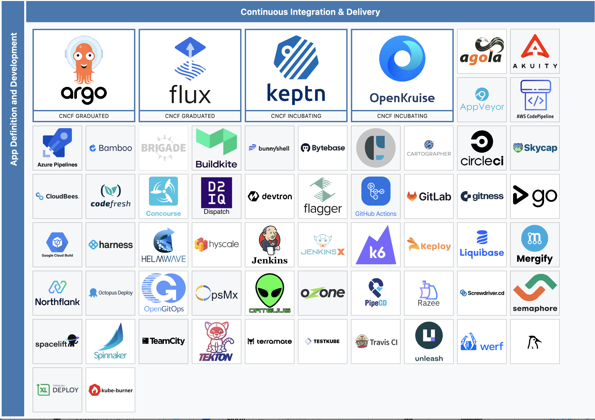

# 4.4 GitOps

GitOps ist eine moderne Methode zur Verwaltung von Infrastruktur und Anwendungen, die DevOps und Git kombiniert. Es ermöglicht die Verwaltung von Infrastruktur und Anwendungen durch Git-Repositories als einzige Quelle der Wahrheit. Änderungen werden durch Pull-Requests in das Git-Repository integriert und automatisch auf die Zielumgebung angewendet. Dies verbessert die Nachvollziehbarkeit, Konsistenz und Automatisierung.

Die Cloud Native Computing Foundation (CNCF) unterstützt eine Vielzahl von GitOps-Tools für das Management von Kubernetes-Clustern und deren Ressourcen. Weitere Informationen können der [CNCF-Landscape](https://landscape.cncf.io/) entnommen werden.

### ArgoCD

ArgoCD ist ein leistungsstarkes GitOps-Tool, das speziell für Kubernetes entwickelt wurde. Es ermöglicht die kontinuierliche Bereitstellung (Continuous Delivery) von Anwendungen und Infrastrukturänderungen, indem es den aktuellen Zustand des Clusters mit dem gewünschten Zustand im Git-Repository vergleicht und Abweichungen automatisch korrigiert. ArgoCD bietet eine benutzerfreundliche Web-Oberfläche, die eine einfache Verwaltung und Überwachung von Anwendungen ermöglicht.

#### Vorteile von ArgoCD:

1. **Automatisierung**:
   ArgoCD automatisiert den Bereitstellungsprozess, indem es Änderungen aus dem Git-Repository kontinuierlich auf das Kubernetes-Cluster anwendet. Dies reduziert manuelle Eingriffe und minimiert die Fehleranfälligkeit.

2. **Nachvollziehbarkeit**:
   Durch die Verwendung von Git als einzige Quelle der Wahrheit bietet ArgoCD eine vollständige Nachvollziehbarkeit aller Änderungen. Jede Änderung kann bis zu ihrem Ursprung im Git-Repository zurückverfolgt werden.

3. **Konsistenz**:
   ArgoCD stellt sicher, dass der Zustand des Clusters immer mit dem gewünschten Zustand im Git-Repository übereinstimmt. Abweichungen werden automatisch erkannt und korrigiert, was zu einer konsistenten und stabilen Umgebung führt.

4. **Benutzerfreundlichkeit**:
   Die Web-Oberfläche von ArgoCD bietet eine intuitive und benutzerfreundliche Möglichkeit, Anwendungen zu verwalten und zu überwachen. Benutzer können den Zustand ihrer Anwendungen leicht einsehen und Änderungen einfach vornehmen.

### Entscheidung für ArgoCD

In der Firma wird ArgoCD bereits erfolgreich eingesetzt, was bedeutet, dass es eine etablierte und bewährte Lösung ist. Obwohl ich persönlich noch keine Erfahrung mit ArgoCD habe, werde ich aufgrund der positiven Erfahrungsberichte mit diesem Tool fortfahren. Dies fördert meinen Lernprozess und ermöglicht es mir, das erlernte Wissen direkt in der Praxis anzuwenden.
