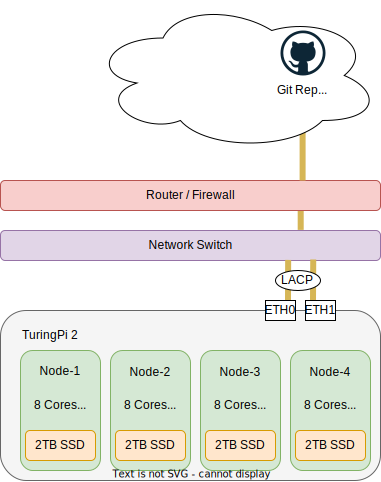
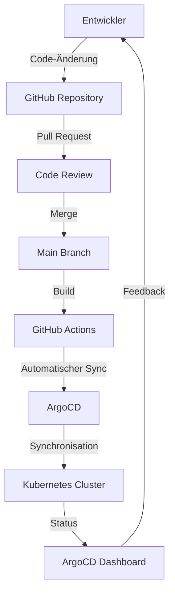

# 4.5 Architektur und Technologie

In der Semesterarbeit kommen eine Vielzahl von Tools und Technologien zum EiPnsatz.

| **Kategorie**                    | **Tool/Technologie**                     |
| -------------------------------- | ---------------------------------------- |
| **Betriebssystem**               | Talos Linux (Immutable Linux OS for K8s) |
| **Hardware**                     | TuringPi 2                               |
| **Distributed Storage Solution** | Longhorn                                 |
| **Source Control**               | Git hosted on GitHub                     |
| **CI/CD**                        | GitHub Actions                           |
| **GitOps**                       | ArgoCD                                   |
| **Paketmanagement**              | Helm                                     |
| **Selfhosted cloud Solution**    | Nextcloud                                |

## Hardware

Der [TuringPi 2](https://turingpi.com/) ist eine modulare Cluster-Plattform, die es ermöglicht, mehrere Compute Module zu einem Cluster zu verbinden. In dieser Konfiguration wird der TuringPi 2 Cluster mit den folgenden Komponenten ausgestattet:

- **4x RK1 8GB RAM**: Diese Compute-Module bieten ausreichend Speicher und Rechenleistung für die Ausführung von Kubernetes-Workloads.
- **4x 2TB NVMe**: Diese NVMe-Festplatten bieten schnellen und zuverlässigen Speicher für die verteilte Speicherlösung Longhorn.

## Kubernetes controlplane & worker

In diesem Cluster sind alle Nodes als Worker konfiguriert. Die Control-Plane-Komponenten sind auf den Nodes `node01`, `node02` und `node03` installiert, um eine hohe Verfügbarkeit zu gewährleisten. Damit die Control-Plane hochverfügbar ist, wird eine virtuelle IP verwendet, die zwischen den Control-Plane-Nodes aufgeteilt wird.

| **Node**   | **Rolle**             |
| ---------- | --------------------- |
| **node01** | Control-Plane, Worker |
| **node02** | Control-Plane, Worker |
| **node03** | Control-Plane, Worker |
| **node04** | Worker                |

## Logical Diagram

Das folgende Diagramm zeigt den hardwaretechnischen und physikalischen Aufbau des Clusters.

## GitOps Flow

Der GitOps-Flow beschreibt den Prozess, bei dem Änderungen am Code automatisch in die Produktionsumgebung übernommen werden. Entwickler nehmen Code-Änderungen vor und erstellen einen Pull Request im GitHub Repository. Nach einer erfolgreichen Code-Überprüfung wird der Code in den Main Branch gemerged. GitHub Actions übernimmt dann den Build-Prozess und stellt sicher, dass der Code fehlerfrei ist. ArgoCD synchronisiert automatisch den gewünschten Zustand aus dem Git-Repository mit dem Kubernetes-Cluster und stellt sicher, dass alle Änderungen konsistent und nachvollziehbar sind. Das ArgoCD Dashboard bietet eine Übersicht über den aktuellen Status und ermöglicht es Entwicklern, Feedback zu erhalten und den Zustand ihrer Anwendungen zu überwachen.

