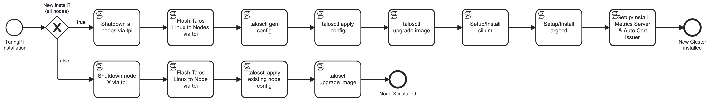

# 5.1 Kubernetes

Ich habe folgende Überlegung gemacht: Wie kann ich meinen Kubernetes Cluster ganz einfach deployen und dies vor allem wieder auf den gleichen Stand bringen, falls was kaputt geht?

Somit war für mich klar, dass ich die Möglichkeit bieten muss, einen ganzen Cluster zu installieren, sowie einzelne Nodes nach zu installieren. Somit kann ich Nodes aus dem Cluster entfernen und für einen anderen Zweck als Kubernetes verwenden und bei bedarf wieder in das K8s einbinden.

## Netzwerkvoraussetzungen

Folgende Einstellungen wurden vor der Installation vorgenommen:

- **DHCP**: Den RK1 Nodes wurden feste IP-Adressen im DHCP zugewiesen, um statische IPs zu vermeiden.
- **DNS**: Alle Nodes haben einen DNS-Record erhalten, damit sie über einen DNS-Namen angesprochen werden können und nicht nur mittels IP.
- **VIP**: Eine virtuelle IP wurde erstellt, sowie ein dazugehöriger DNS-Record, damit die Control-Plane diese verwenden kann.

## TuringPi BMC

Der TuringPi BMC-Chip dient als Management Interface und kann mit einem ILO Admin Interface verglichen werden. Ein einfaches CLI-Tool ermöglicht sämtliche administrativen Aufgaben. In dieser Arbeit wird das BMC hauptsächlich verwendet, um die Nodes ein- und auszuschalten sowie das Betriebssystem zu installieren.

Die `tpi` Software ist als Open-Source-Projekt auf GitHub erhältlich: [github.com/turing-machines/tpi](https://github.com/turing-machines/tpi)

## Talos Linux

Talos Linux ist ein unveränderliches (immutable) Linux, bei dem keine Anpassungen direkt vorgenommen werden können. Sämtliche Konfigurationen müssen entweder ins Bootable Image integriert oder via `talosctl` durchgeführt werden. Ein Zugriff mittels SSH ist somit nicht möglich.

Für dieses Setup wird die Bare-metal-Installation verwendet, bei der ein Image auf die Nodes geflasht wird.

### System Extensions

Damit später Longhorn betrieben werden kann, müssen auf sämtlichen K8s-Nodes System Extensions installiert werden. Da Talos ein immutable Linux ist, müssen diese Extensions ins Image eingebaut und danach in einer Container Registry veröffentlicht werden. Talos lädt dieses OCI-Image herunter und bootet dann mit dem neuen Image. Dies bietet den Vorteil, dass bei Problemen einfach auf das alte Image zurückgebootet werden kann.

Eine wichtige Extension ist die iSCSI-Extension, die für den Betrieb von Longhorn erforderlich ist. Das Bauen der Extensions wurde im [sem04_setup](https://github.com/Cloud-native-engineering/sem04_setup/blob/main/.github/workflows/ci.yaml) als GitHub Actions CI/CD integriert.

## Setup Process

Das entwickelte Setup-Programm ermöglicht es, alle Schritte in einem einzigen Durchgang durchzuführen. Das Programm wurde als separates Projekt auf GitHub unter der MIT-Lizenz veröffentlicht. Sämtliche Informationen zum Installationsprozess und zum Setup-Programm können im folgenden Repository eingesehen werden:

- [github.com/Cloud-native-engineering/sem04_setup](https://github.com/Cloud-native-engineering/sem04_setup/tree/main)

```bash
Usage: ./setup.sh [options]
Options:
  -d, --download            Download images from internet
  -i, --install             Install node
  -k, --k8s                 Configure Kubernetes
  -n, --node [1,2,3,4]      Specify which node (default: all)
  -h, --help                Display this help message
```



Zunächst müssen alle Nodes mit `setup.sh -i && setup.sh -k` installiert werden, damit die Talos-Konfigurationen generiert werden. Nach dieser initialen Installation können einzelne Nodes vom Cluster entfernt, hinzugefügt oder neu installiert werden.
