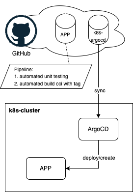

# 6.1 ArgoCD

Damit der Kubernetes Cluster mittels GitOps verwaltet werden kann, wird ArgoCD eingesetzt. Die Single Source of Truth ist in einem SCM-Repository abgelegt. ArgoCD vergleicht kontinuierlich die Ressourcen in Kubernetes mit dem Git-Repository. Wenn der Status nicht mehr übereinstimmt, wird ArgoCD die notwendigen Ressourcen erstellen oder aktualisieren, um den gewünschten Zustand wiederherzustellen.

Das obige Bild zeigt sehr gut den Lifecycle einer K8s Applikation. Mit ArgoCD können die Verantwortlichkeiten sauber zwischen verschiedenen Teams getrennt werden. Die Applikation (Quellcode) und die K8s Definitionen werden in einem separaten Repository gepflegt.

## Applikationsseite

1. **Code**: Die Applikation wird entwickelt.
2. **Test**: Die Applikation wird mittels einer Pipeline getestet.
3. **Build**: Die Applikation wird verpackt, in diesem Beispiel als Open Container Image (OCI), und auf einer Registry veröffentlicht.
4. **Optimize**: Kontinuierliches Scannen und Aktualisieren von Abhängigkeiten, Eliminierung von Bugs und Entwicklung neuer Features.

## Operations

1. **Deploy**: ArgoCD stellt sicher, dass sämtliche Ressourcen im Cluster erstellt und auf dem neuesten Stand sind.
2. **Monitor**: ArgoCD überwacht kontinuierlich den Zustand der Ressourcen und stellt sicher, dass sie mit dem gewünschten Zustand im Git-Repository übereinstimmen.
3. **Update**: Der Renovate Bot scannt kontinuierlich nach neuen Versionen von OCI-Images oder Helm-Charts und erstellt automatisch Pull Requests, um die Abhängigkeiten zu aktualisieren.
4. **Rollback**: Im Falle eines Fehlers kann ArgoCD schnell auf eine vorherige Version zurücksetzen, um die Stabilität des Clusters zu gewährleisten.

Durch die Verwendung von ArgoCD und dem GitOps-Ansatz wird sichergestellt, dass der Kubernetes Cluster stets konsistent und reproduzierbar ist. Änderungen am Cluster werden versioniert und nachvollziehbar im Git-Repository dokumentiert, was die Zusammenarbeit und Wartung erheblich erleichtert.

## Wo finde ich die Kubernetes Manifeste für diese Semesterarbeit?

Die Kubernetes Manifeste für diese Semesterarbeit wurden in einem eigenen GitHub Repository veröffentlicht. Sie können unter folgendem Link aufgerufen werden: [cloud-native-engineering/sem04_k8s](https://github.com/Cloud-native-engineering/sem04_k8s)
