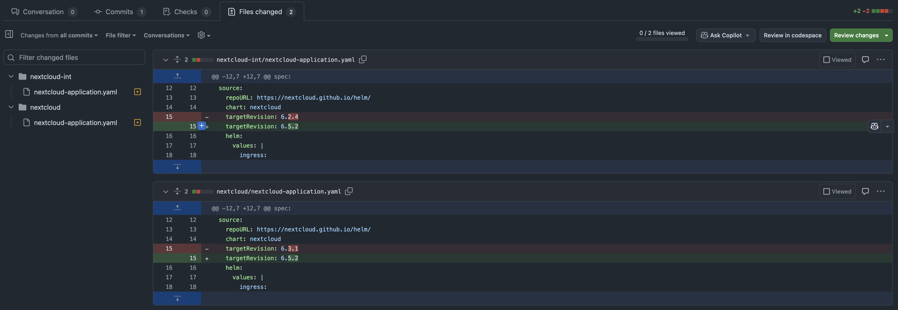

# 6.2 Renovate Bot

Der Renovate Bot ist ein nützliches Werkzeug, das sicherstellt, dass stets die neuesten Abhängigkeiten verwendet werden. Dies hilft, Bugs und Sicherheitslücken zu minimieren. In dieser Semesterarbeit wird der Renovate Bot hauptsächlich für die Verwaltung der Versionen von Open Container Images (OCI) und Helm Charts eingesetzt.

Renovate Bot automatisiert die Aktualisierung von Abhängigkeiten in Projekten, indem er Pull Requests erstellt, wenn neue Versionen verfügbar sind. Dies erleichtert die Wartung und sorgt dafür, dass Projekte immer auf dem neuesten Stand sind.

## Wie funktioniert der Renovate Bot?

Damit Renovate richtig funktioniert, muss im dazugehörigen Projekt eine `renovate.json` Datei abgelegt werden. Zusätzlich muss die GitHub App installiert werden, damit Renovate mit Tokens auf den Repositories Aktionen ausführen kann. Die folgende GitHub App muss installiert werden: [Renovate](https://github.com/apps/renovate).

Beispiel einer `renovate.json` Konfigurationsdatei, welcher in der folgenden Arbeit verwendet wurde:

```json
{
  "$schema": "https://docs.renovatebot.com/renovate-schema.json",
  "extends": ["config:base"],
  "kubernetes": {
    "fileMatch": ["\\.yaml$"]
  },
  "argocd": {
    "fileMatch": ["\\.yaml$"]
  }
}
```

## Warum Renovate und nicht Dependabot?

Renovate bietet im Vergleich zu Dependabot einige Vorteile:

- **Flexibilität**: Renovate bietet mehr Konfigurationsmöglichkeiten und kann an die spezifischen Bedürfnisse eines Projekts angepasst werden.
- **Recursive Scanning**: Renovate erkennt Dateien und deren Zusammenhänge in mehreren Unterverzeichnissen, was besonders im Zusammenhang mit ArgoCD nützlich ist. Dependabot bietet diese Möglichkeit nicht.
- **Support für mehrere Plattformen**: Renovate unterstützt eine Vielzahl von Plattformen und Paketmanagern, darunter npm, Docker, Helm, Maven und viele mehr.
- **Automatisierte Merge-Optionen**: Renovate kann so konfiguriert werden, dass es Pull Requests automatisch merged, wenn bestimmte Bedingungen erfüllt sind, was den manuellen Aufwand reduziert.
- **Erweiterte Scheduling-Optionen**: Renovate ermöglicht es, Updates zu bestimmten Zeiten oder in bestimmten Intervallen durchzuführen, um den Workflow nicht zu stören.

Durch den Einsatz von Renovate Bot in dieser Semesterarbeit wird sichergestellt, dass die verwendeten Abhängigkeiten immer aktuell sind, was die Sicherheit und Stabilität des Projekts erhöht.

## Was bietet mir Renovate genau?

Renovate Bot scannt nach dem definierten Schema und der Konfiguration im Repository nach neuen Versionsupdates von Abhängigkeiten. In diesem Projekt sind es hauptsächlich Kubernetes, Helm und ArgoCD Abhängigkeiten. Wenn es nun eine neue Helm-Version gibt, eröffnet Renovate automatisch einen Pull Request mit den dazugehörigen Änderungen.

### Pull Request / Merge Request

Renovate eröffnet den Pull Request mit einer sehr guten und ausgeklügelten Beschreibung.


Die Anpassungen wurden bereits durch Renovate übernommen und sind im PR inkludiert.


