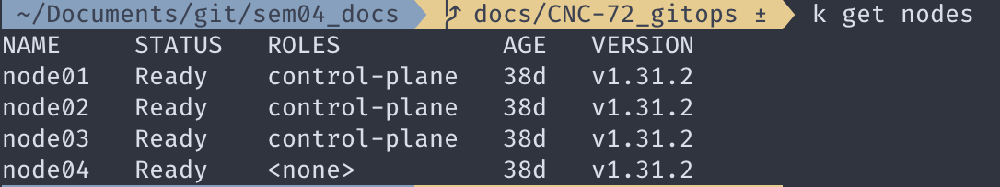
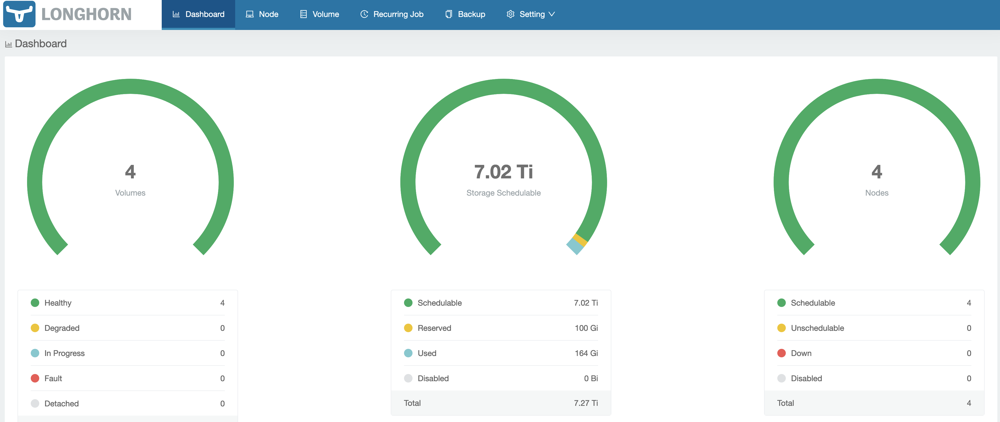
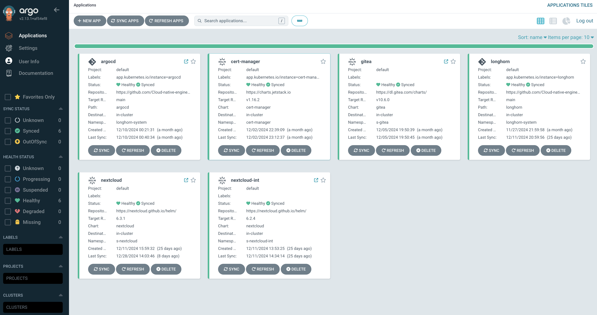
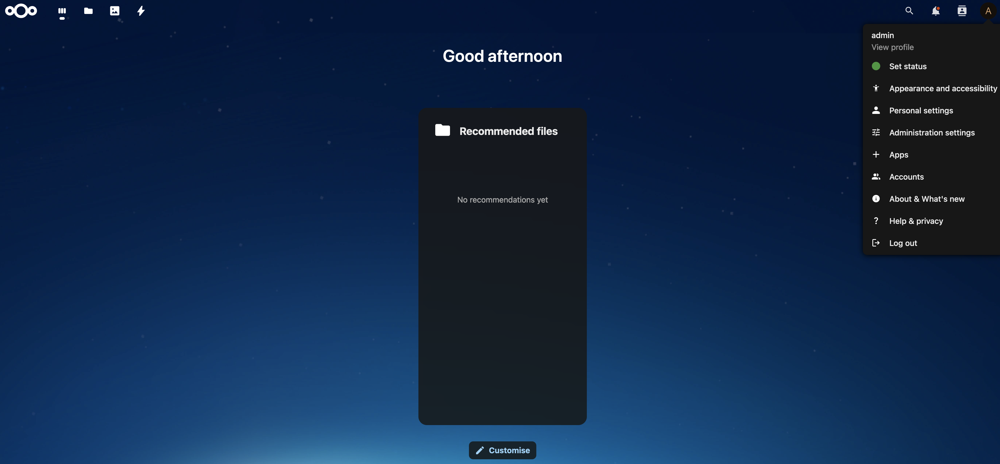
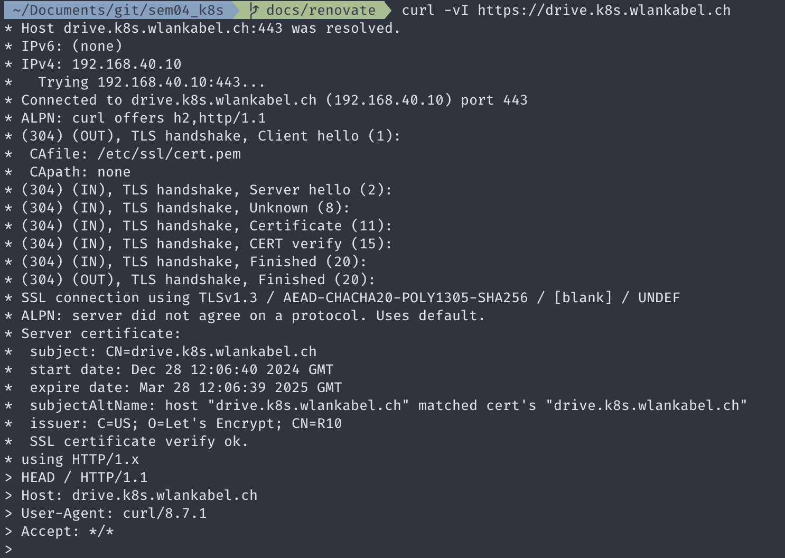
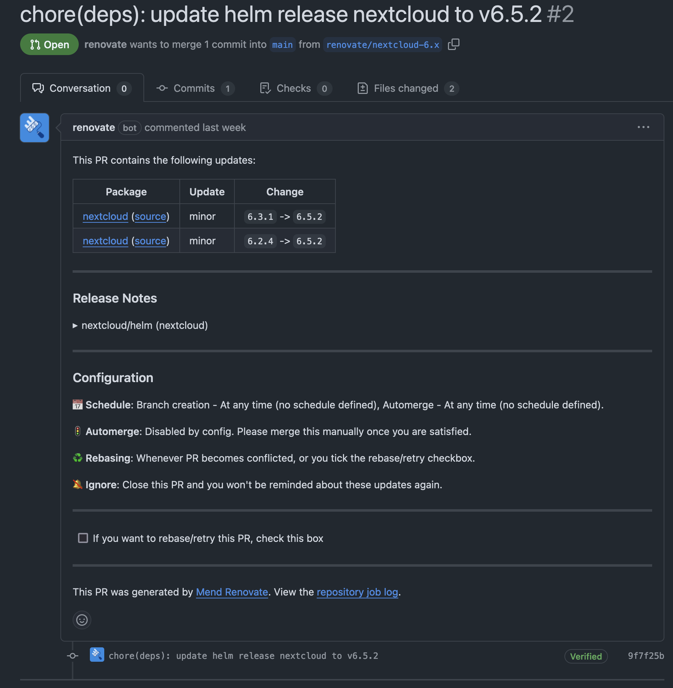

# 7. Integrationstests

Um sicherzustellen, dass sämtliche Microservices in dieser Semesterarbeit zusammen funktionieren, werden Integrationstests durchgeführt. Diese Tests werden als manuelle Tests ausgeführt. Ziel dieser Tests ist es, die technische Funktionsfähigkeit des Kubernetes-Cluster zu bestätigen und zu demonstrieren, dass die festgelegten Ziele dieser Arbeit erreicht wurden. Im Rahmen dieser Tests wurden folgende Funktionalitäten überprüft:

- Kubernetes Cluster
- Connectivity
- Longhorn
- Cilium
- Cert-manager
- Nextcloud

## Test-001 - Kubernetes Setup

| Testfall-001      | k8s_setup                                                                                                                         |
| ----------------- | --------------------------------------------------------------------------------------------------------------------------------- |
| **Ziel:**         | Der K8s-Cluster wurde erfolgreich aufgesetzt und ist mittels `kubectl` erreichbar                                                 |
| **Beschreibung:** | Befehl auf der Konsole ausführen: `kubectl get nodes`                                                                             |
| **Soll-Wert:**    | Sämtliche Nodes haben den Status `READY`                                                                                          |
| **Ist-Wert:**     | Alle Nodes haben den Status `READY`   

 |

## Test-002 - Distributed Storage

| Testfall-002  | longhorn_setup                                                                                                                                                                                                     |
| :------------ | :----------------------------------------------------------------------------------------------------------------------------------------------------------------------------------------------------------------- |
| Ziel:         | Longhorn ist installiert und es kann auf das UI zugegriffen werden.                                                                                                                                                |
| Beschreibung: | Es soll ein Portworward geöffnet werden mit folgendem Befehl `kubectl port-forward svc/longhorn-frontend -n longhorn-system 8081:80 --insecure-skip-tls-verify` und nachher mit dem Browser auf die URL zugreiffen |
| Soll-Wert:    | Das Longhorn UI wird angezeigt und es erscheinen keine Fehler                                                                                                                                                      |
| Ist-Wert:     | Der Zugriff auf das UI klappt   

                                                                                        |

## Test-003 - Cilium Ingress

| Testfall-003  | cilium_ingress                                                                                                                                                                               |
| :------------ | :------------------------------------------------------------------------------------------------------------------------------------------------------------------------------------------- |
| Ziel:         | Der Cilium Ingress Controller ist via eine Externe IP erreichbar.                                                                                                                            |
| Beschreibung: | Mittels folgendem Befehl die extene IP des services herausfinden und mittels curl versuchen darauf zuzugreiffen: `k get svc -n kube-system`                                                  |
| Soll-Wert:    | Es wird erwartet, dass Curl die Rückmeldung gibt, dass die Verbindung zurückgeset wurde vom peer. Die Verbindung funktioniert, nur kann der Host-Header zu keinem Service zugewiesen werden. |
| Ist-Wert:     | `curl: (35) Recv failure: Connection reset by peer`                                                                                                                                          |

## Test-004 - ArgoCD

| Testfall-004  | argocd_sync                                                                                                                                     |
| :------------ | :---------------------------------------------------------------------------------------------------------------------------------------------- |
| Ziel:         | ArgoCD verwaltet die Ressourcen im Kubernetes-cluster.                                                                                          |
| Beschreibung: | Mittels Webbrowser soll auf ArgoCD zugegriffen werden. Es soll den Sync Status der ArgoCD-Applikationen überprüft werden.                       |
| Soll-Wert:    | Sämtliche Applikationen sind im Status Healthy und Synced                                                                                       |
| Ist-Wert:     | Alle ArgoCD-Applikationen sind Healthy und Synced   

 |

## Test-005 - Nextcloud

| Testfall-005  | Nextcloud                                                                                                                        |
| :------------ | :------------------------------------------------------------------------------------------------------------------------------- |
| Ziel:         | Nextcloud wurde erfolgreich installiert und es kann darauf zugegriffen werden.                                                   |
| Beschreibung: | Mit einem Webbrowser auf Nextcloud zugreifen und sich mit den Anmeldedaten aus dem Kubernetes Secret `nextcloud-secret` anmelden |
| Soll-Wert:    | Login funktioniert.                                                                                                              |
| Ist-Wert:     | Anmeldung erfolgreich.   

             |

## Test-006 - Cert Manager

| Testfall-006  | certManager_letsEncrypt                                                                                                                                                    |
| :------------ | :------------------------------------------------------------------------------------------------------------------------------------------------------------------------- |
| Ziel:         | Der CertManager stellt vertrauenswürdige Zertifikate mittels Let's Encrypt aus.                                                                                            |
| Beschreibung: | Es soll folgenden Curl Befehl ausgeführt werden `curl -vI drive.k8s.domain.local`                                                                                          |
| Soll-Wert:    | `issuer: C=US; O=Let's Encrypt; CN=R10`                                                                                                                                    |
| Ist-Wert:     | Der issuer ist korrekt und ein Webbrowser zeigt das Zertifikat als valid an.   

 |

## Test-007 - Renovate Bot

| Testfall-007  | renovate                                                                                                                                        |
| :------------ | :---------------------------------------------------------------------------------------------------------------------------------------------- |
| Ziel:         | Der Renovate Bot eröffnet eine Pull-Request, wenn eine neue Version einer Helm-Chart verfügbar ist.                                             |
| Beschreibung: | Deployen einer alten Version von Nextcloud im K8s-Cluster via ArgoCD                                                                            |
| Soll-Wert:    | Ressourcen werden erstellt. Nach einiger Zeit eröffnet Renovate ein Pull-Request, mittels welchem er Changes mergen will mit den neuen Version. |
| Ist-Wert:     | Renovate erstellt einen Pull-Request. 

                  |

## Fazit

Die Testergebnisse bestätigen eindrucksvoll die Funktionsfähigkeit aller in dieser Arbeit implementierten Funktionalitäten. Sie zeigen, dass der Kubernetes Cluster zusammen mit der Distributed Storage Solution vollständig einsatzbereit und effektiv ist.
