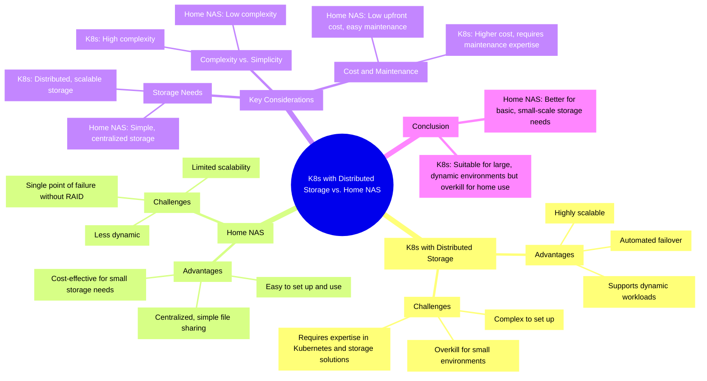

# Can Kubernetes with Distributed Storage Replace a Home NAS?

Im Zeitalter der digitalen Transformation suchen immer mehr private Haushalte nach zuverlässigen und effizienten Lösungen zur Speicherung und Verwaltung ihrer Daten. Ein zentraler Aspekt dabei ist die Datenhoheit und der Speicherort der eigenen Daten, welche beim Enduser liegen und nicht bei einem Cloud-Provider wie OneDrive von Microsoft oder Google Drive von Google. Traditionelle NAS-Systeme (Network Attached Storage) sind zwar weit verbreitet, stossen jedoch zunehmend an ihre Grenzen in Bezug auf Skalierbarkeit, Flexibilität und Verwaltung. Kubernetes (K8s) hat sich als leistungsstarke Plattform zur Orchestrierung von containerisierten Anwendungen etabliert, aber kann K8s mit verteiltem Speicher eine tragfähige Alternative zu einem herkömmlichen NAS für den Heimgebrauch darstellen? Diese Semesterarbeit zielt darauf ab, die Machbarkeit und Vorteile eines solchen Setups zu untersuchen. Durch die Implementierung und den Vergleich von Kubernetes mit verteiltem Speicher und einem traditionellen NAS sollen Aspekte wie Leistung, Benutzerfreundlichkeit, Kosten und Skalierbarkeit bewertet werden. Ziel ist es, zu bestimmen, ob K8s mit verteiltem Speicher eine praktikable und vorteilhafte Lösung für die private Datenspeicherung und -verwaltung bieten kann.

## Ziele

- **K8s vs NAS**: Ziel dieser Analyse ist es, die Stärken und Schwächen von Kubernetes (K8s) im Vergleich zu herkömmlichen NAS-Systemen herauszuarbeiten. Dabei sollen sowohl Leistung und Skalierbarkeit als auch Benutzerfreundlichkeit und Kosten berücksichtigt werden. Durch einen detaillierten Vergleich soll ermittelt werden, in welchen Anwendungsbereichen K8s eine sinnvolle Alternative zu NAS darstellen kann.
- **Distributed Storage**: Ziel ist es, die Implementierung und Nutzung von verteiltem Speicher innerhalb eines Kubernetes-Clusters zu untersuchen. Es soll dargestellt werden, wie diese Technologie zur Verbesserung der Datenverfügbarkeit und Sicherheit beitragen kann und welche Herausforderungen und Vorteile sich daraus für den Heimgebrauch ergeben.
- **GitOps**: Ziel ist es, die Deployment-Strategien einer eigenen personal Cloud für eigene Dateien mit GitOps zu implementieren und zu evaluieren. Dabei soll gezeigt werden, wie durch die Verwendung von GitOps-Praktiken ein automatisierter, effizienter und sicherer Bereitstellungsprozess für den Service erreicht werden kann.

## Dokumente

- [Einreichungsformular Semesterarbeit](../resources/artifacts/2024_Semesterarbeit04_Einreichungsformuar.pdf)

